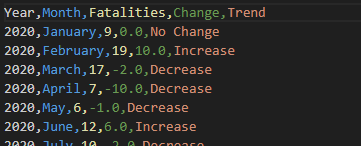
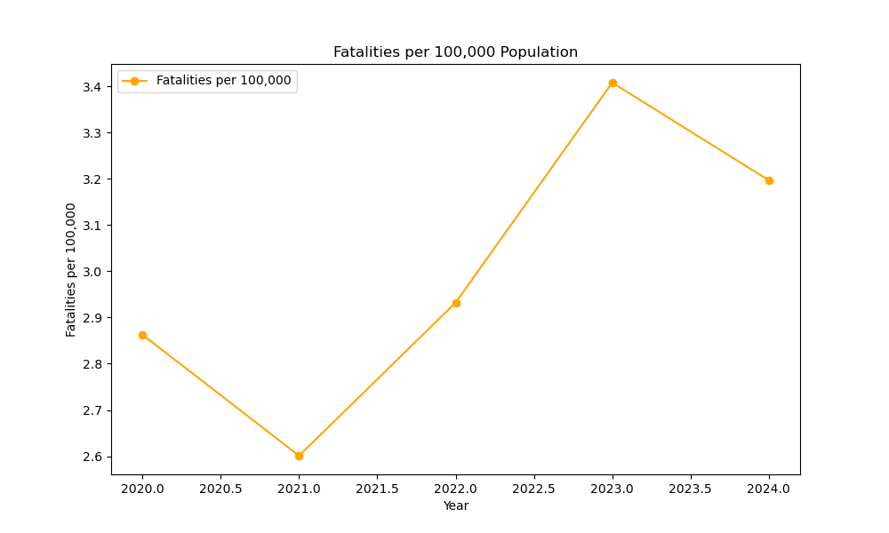

# Road Safety Analysis Project

This README provides a comprehensive guide to the Road Safety Analysis Project, which analyzes and visualizes road fatalities in Ireland using data from the Central Statistics Office (CSO). 

It explains the project’s purpose, how the data is collected and processed, how to use the backend API and frontend dashboard, and how to interpret the results. 

You’ll also find setup instructions, testing steps, and references for further reading.

**In summary:**  
- This file explains what each part of the project does.
- It guides you through setup, usage, and analysis.
- It helps you understand the meaning and significance of the data and results.

If you want to understand, run, or extend this project, start here.

## Table of Contents

- [Overview](#overview)
- [Features](#features)
- [Author](#author)
- [License](#license)
- [Project Structure](#project-structure)
  - [Script Dependency Summary](#script-dependency-summary)
- [Technical Set Up](#technical-set-up)
- [Pre-Requisites](#pre-requisites)
- [How Flask Interacts with the CSO API and Data Flow](#how-flask-interacts-with-the-cso-api-and-data-flow)
- [Getting Started](#getting-started)
- [Manual Testing](#manual-testing)
  - [API Testing with Postman](#api-testing-with-postman)
  - [Test CRUD API Endpoints](#test-crud-api-endpoints)
- [Endpoint Reference Table](#endpoint-reference-table)
- [Automated Data Processing and Analysis](#automated-data-processing-and-analysis)
  - [Data Retrieval](#data-retrieval)
    - [Fetch Road Fatalities Data](#1-fetch-road-fatalities-data)
    - [Trend Analysis](#2-trend-analysis)
    - [Fetch Population Data](#3-fetch-population-data)
  - [Data Analysis](#data-analysis)
    - [Monthly Trend Analysis](#4-monthly-trend-analysis)
    - [Summary of Analysis](#summary-of-analysis)
    - [Quarterly Summary](#quarterly-summary)
    - [Why Filtering and Structuring Was Necessary](#why-filtering-and-structuring-was-necessary)
    - [Analyse yearly fatality data totals per capita and per 100,000 population.  Compare with european averages](#analyse-yearly-fatality-data-totals-per-capita-and-per-100000-population--compare-with-european-averages)
    - [Tasks performed by the code](#tasks-performed-by-the-code)
- [Code of Conduct](#code-of-conduct)
- [Data Content Relevant To Task](#data-content-relevant-to-task)
- [Insights on Fatalities and Population Data](#insights-on-fatalities-and-population-data)
- [Road Fatalities in Ireland vs. European Average (Per 100,000 Population)](#road-fatalities-in-ireland-vs-european-average-per-100000-population)
  - [Comparison in Key Findings](#comparison-in-key-findings)
- [Terminal Output](#terminal-output)
- [Frontend Development & Running the Frontend](#frontend-development--running-the-frontend)
  - [Features](#features-1)
  - [File Structure](#file-structure)
  - [How to Run the Frontend](#how-to-run-the-frontend)
  - [Troubleshooting](#troubleshooting)
- [OAuth (Open Authorization)](#part-e-oauth-open-authorization)
- [Conclusion](#conclusion)
- [Acknowledgements](#acknowledgements)
- [Project References](#project-references)

---

## Overview

The Road Safety Analysis Project examines road fatalities in Ireland over the past five years, identifying trends and patterns in fatality data. The project integrates data from the Central Statistics Office (CSO) API and provides a custom API for CRUD operations on locally stored data. It also includes data visualization and analysis tools to offer insights into road safety trends. 

This project compares Ireland's road fatality data to published European yearly averages, providing insights into whether Ireland's death rates are higher or lower. The project is designed to be user-friendly, secure, and extensible.

---

## Features

- **Data Integration**: Retrieves road safety data from the CSO API.
- **Custom API**: Enables CRUD operations on locally stored fatality data using Flask.
- **Data Analysis**: Identifies trends in road fatalities and visualizes them using charts.
- **Frontend Interface**: Provides an interactive line chart displaying road fatality trends over time, segmented by month and year.
- **Secure Access**: OAuth authentication may be implemented in the future if the API is deployed in a public environment to ensure secure access and data protection.

---

## Author

- **Name**: Edward Cronin
- **Student ID**: g00425645
- **Email**: g00425645@atu.ie

---

## License

This project is licensed under the [Apache License 2.0](./LICENSE). See the LICENSE file for details.

---

## Project Structure
```
WSAA-Project/
│
├── data/
│   ├── fatalities_data.png                      # Visualization of overall road fatalities data
│   ├── Fatalities_per_100000.png                # Line chart: fatalities per 100,000 population over the years
│   ├── fatalities_trend_graph.png               # Line graph: monthly fatalities and quarterly splits
│   ├── fatality_analysis_chart.png              # Dual-axis chart: total fatalities and fatalities per 100,000
│   ├── fatality_analysis.csv                    # Yearly fatalities, population, and normalized metrics
│   ├── fatality_trends.csv                      # Monthly trend analysis results (increase/decrease)
│   ├── five_yr_fatalities.csv                   # Filtered fatalities data for the last five years
│   ├── monthly_fatalities_over_the_last_5_years.png # Monthly fatalities graph for the last five years
│   ├── population_breakdown.csv                 # Yearly population data from CSO API
│   ├── road_fatalities.csv                      # Raw processed road fatalities data from CSO API
│   ├── terminal_message_crud_api.png            # Screenshot: terminal output for CRUD API operations
│   └── terminal_output_fatalities_per_capita.png# Screenshot: terminal output for per capita analysis
│
├── src_files/
│   ├── 01_fatalities.py                         # Fetches and saves raw road fatalities data from CSO API
│   ├── 02_trendanalysis.py                      # Filters and analyzes last 5 years of fatalities
│   ├── 03_population.py                         # Fetches and saves population data from CSO API
│   ├── 04_data_analysis.py                      # Analyzes and visualizes monthly trends in fatalities
│   ├── 05_app.py                                # Provides an API for managing and updating road fatality records via Create, Read, Update, and Delete operations
│   └── 06_analyze_fatalities.py                 # Calculates fatalities per capita and per 100,000, generates visualizations
│
├── static/
│   ├── index.html                               # Main HTML file for the frontend dashboard
│   ├── app.js                                   # JavaScript for fetching data and rendering charts/tables
│   └── styles.css                               # Stylesheet for the frontend interface
│
├── [README.md](http://_vscodecontentref_/0)                                    # Project documentation
├── requirements.txt                             # Python dependencies for the project
└── LICENSE                                      # License file
```
---

### Script Dependency Summary

```markdown
| Script Name              | Input Files Required                                   | Output Files Generated                                                                 | Description                                                                                  |
|--------------------------|--------------------------------------------------------|----------------------------------------------------------------------------------------|----------------------------------------------------------------------------------------------|
| 01_fatalities.py         | None (fetches from CSO API)                            | data/road_fatalities.csv                                                               | Fetches and saves raw road fatalities data from the CSO API                                  |
| 02_trendanalysis.py      | data/road_fatalities.csv                               | data/five_yr_fatalities.csv                                                            | Filters and analyzes the last 5 years of fatalities                                          |
| 03_population.py         | None (fetches from CSO API)                            | data/population_breakdown.csv                                                          | Fetches and saves population data from the CSO API                                           |
| 04_data_analysis.py      | data/five_yr_fatalities.csv                            | data/fatality_trends.csv, data/fatalities_trend_graph.png                              | Analyzes and visualizes monthly trends in fatalities                                         |
| 05_app.py                | data/five_yr_fatalities.csv                            | Serves API responses (no new files generated)                                           | Flask API for managing and updating road fatality records (CRUD operations)                  |
| 06_analyze_fatalities.py | data/five_yr_fatalities.csv, data/population_breakdown.csv | data/fatality_analysis.csv, data/Fatalities_per_100000.png, data/fatality_analysis_chart.png | Calculates per capita and per 100,000 metrics, generates summary visualizations              |
```
---

## Technical Set Up

1. **Backend**:
   - Flask for RESTful API development.
   - Integration with the CSO API for data retrieval.
2. **Frontend**:
   - Interactive web interface using HTML, CSS, jQuery, and AJAX.
3. **Data Analysis**:
   - Data manipulation and visualization using `pandas`, `matplotlib`, and `seaborn`.
4. **Testing**:
   - API testing with Postman and CURL.
---

## Pre-Requisites

- **Languages:** Python (>=3.8), JavaScript, HTML, CSS

- **Tools:**  
  - **Git:** Used for version control and collaboration  
  - **Postman:** Used for testing API endpoints  
  - **CURL:** Used for making HTTP requests to fetch data from APIs  
  - **Flask:** Framework for building the backend API

- **Libraries:**
  - **Backend-related:**
    - `Flask>=2.0` – Web framework for the RESTful API
    - `flask-restful>=0.3` – Extension for building REST APIs with Flask
    - `flask-cors>=3.0` – For enabling CORS in Flask apps
  - **Data-related:**
    - `pandas>=1.3` – Data manipulation and analysis
    - `numpy>=1.21` – Numerical operations
    - `matplotlib>=3.4` – Data visualization
    - `seaborn>=0.11` – Statistical data visualization
  - **Frontend-related:**
    - jQuery (CDN or local, >=3.6) – DOM manipulation and AJAX
    - Chart.js (CDN or local, >=3.5) – Chart rendering

---

## How Flask Interacts with the CSO API and Data Flow

The Flask backend in this project **does not fetch live data directly from the CSO API on each API request**. Instead, the data flow is as follows:

1. **Data Retrieval Scripts:**  
   - Python scripts such as `01_fatalities.py` and `03_population.py` are used to fetch live data from the CSO API.
   - These scripts are run manually (or as part of the setup process) and save the data locally as CSV files (e.g., `road_fatalities.csv`, `population_breakdown.csv`).

2. **Local Data Storage:**  
   - The fetched data is stored in the `data/` directory as CSV files.
   - The data served by the Flask API is as current as the last time the data retrieval scripts were run.

3. **Flask API (`05_app.py`):**  
   - The Flask app reads from these local CSV files to serve data via its endpoints.
   - When you interact with the API (e.g., via `/api/fatalities`), Flask reads and manipulates the local CSV files, not the live CSO API.

4. **No Live Fetching or Caching in Flask:**  
   - **No live fetching:** Flask does **not** fetch data from the CSO API on each request.
   - **No caching layer:** Flask simply reads from and writes to the local CSV files. If you want updated data, you must re-run the data retrieval scripts.

**Summary Table:**

| Step                | Source/Destination         | Live Fetch? | Caching? |
|---------------------|---------------------------|-------------|----------|
| Data scripts        | CSO API → CSV files       | Yes         | No       |
| Flask API endpoints | CSV files → API responses | No          | No       |

**How Data Flows:**
1. You run a script (e.g., `python src_files/01_fatalities.py`) → Data is fetched from CSO API and saved as CSV.
2. Flask reads the CSV files and serves data via its API endpoints.
3. If you want the latest data, you must re-run the data retrieval scripts.

> *In summary: Flask serves data from local files, not directly from the CSO API. There is no caching mechanism in Flask; data freshness depends on how recently you ran the data-fetching scripts.*
---

## Getting Started

Follow these steps to set up and use the Road Safety Analysis Project.

### 1. Clone the Repository

To download this repository, use the following command:

```bash
git clone https://github.com/ECronin1973/WSAA-Project
cd WSAA-Project
```

### 2. Install Dependencies

Ensure you have Python 3.8+ installed. Then run:

```bash
pip install -r requirements.txt
```

## Manual Testing

Manual testing ensures that your API endpoints and data processing scripts work as expected before integrating them into automated workflows or the frontend.

### API Testing with Postman

#### 1. Retrieve Data from CSO API
Using CURL:

```bash
curl -X GET "https://ws.cso.ie/public/api.restful/PxStat.Data.Cube_API.ReadDataset/ROA29/JSON-stat/1.0/en" -H "Content-Type: application/json"
```

This command fetches the latest road fatalities data in JSON-stat format from the CSO API.

**Using Postman:**

1. Open Postman and create a new request.
2. Set the HTTP method to GET.
3. Enter the URL:
- https://ws.cso.ie/public/api.restful/PxStat.Data.Cube_API.ReadDataset/ROA29/JSON-stat/1.0/en
4. Set the header:
- Content-Type: application/json
5. Click Send and review the JSON-stat response

### 2. Test CRUD API Endpoints
The backend API provides endpoints for creating, reading, updating, and deleting road fatalities records. Use Postman to test each operation:

1. Create a New Record (POST)

##### 1. Create a New Record

**Request:**
```
POST http://127.0.0.1:5000/api/fatalities
Content-Type: application/json

{
    "month": "January",
    "fatalities": 186,
    "Year": 2020
}
```
**Purpose:**

This command was used to manually test the creation of a new record in the API.
The id field was omitted because it is automatically generated by the API.

**Expected Response:**
```
{
    "message": "Record created successfully",
    "record": {
        "id": 1,
        "Year": 2020,
        "Month": "January",
        "Fatalities": 186
    }
}
```

**Response:**
```
{
    "message": "Record created successfully",
    "record": {
        "id": 1,
        "Year": 2020,
        "Month": "January",
        "Fatalities": 186
    }
}
```

##### 2. Read All records

**Request:**
```
GET http://127.0.0.1:5000/api/fatalities
```

**Purpose:**

This command was used to fetch all records from the API and verify that the data was being retrieved correctly.

**Expected Response:**
```
[
    {
        "id": 1,
        "Year": 2020,
        "Month": "January",
        "Fatalities": 186
    },
    {
        "id": 2,
        "Year": 2020,
        "Month": "February",
        "Fatalities": 150
    }
]
```

**Response**
```
{
        "id": 29,
        "Month": "May",
        "Fatalities": 12,
        "Year": 2022
    },
    {
        "id": 30,
        "Month": "June",
        "Fatalities": 13,
        "Year": 2022
    }

```
##### 3. Update a Record

**Request:**
```
PUT http://127.0.0.1:5000/api/fatalities/2
Content-Type: application/json

{
    "Fatalities": 186
}
```

**Purpose:**

This command was used to update an existing record by specifying its id in the URL and providing the updated data in the request body.

**Expected Response:**
```
{
    "message": "Record updated successfully",
    "record": {
        "id": 2,
        "Year": 2020,
        "Month": "January",
        "Fatalities": 186
    }
}
```
**Response**
```
{
    "message": "Record updated successfully",
    "record": {
        "id": 2,
        "Month": "February",
        "Fatalities": 19,
        "Year": 2020,
        "fatalities": 186.0
    }
}
```

##### Read a Specific Record by ID (GET)

**Request:**
```
GET http://127.0.0.1:5000/api/fatalities/2
```

**Purpose:**

This command was used to fetch record number 2 by its id ( 2) to verify that it was updated correctly.

**Expected Response:**
```
{
    "id": 2,
    "Month": "February",
    "Fatalities": 19,
    "Year": 2020,
    "fatalities": 186.0
}


**Response**
```
    {
        "id": 2,
        "Month": "February",
        "Fatalities": 19,
        "Year": 2020,
        "fatalities": 186.0
    },

##### 4. Delete a Record

**Request:**
```
DELETE http://127.0.0.1:5000/api/fatalities/1
```

**Purpose:**

This command was used to delete a record by specifying its id in the URL.

**Response**
```
{
    "message": "Record deleted successfully"
}
```

### Summary of Manual Testing

- Tools Used: Postman was used to manually test the CRUD operations.
- Purpose: To ensure that the API endpoints for Create, Read, Update, and Delete operations functioned as expected.
- Outcome: All CRUD operations were successfully tested, and the API responded with the expected results.

### References for This Section

**Flask Documentation**
[Flask Official Documentation](https://flask.palletsprojects.com/en/stable/)
Provides detailed information on how to build web applications using Flask.

**Flask-RESTful Documentation**
[Flask-RESTful Documentation](https://flask-restful.readthedocs.io/en/latest/)
Explains how to create RESTful APIs using Flask-RESTful, including the Resource class and route management.

**Postman Documentation**
[Postman Documentation](https://www.postman.com/)
Useful for testing CRUD API endpoints.

**Python Requests Library**
[Requests Library Documentation](https://requests.readthedocs.io/en/latest/)
Covers how to make HTTP requests and handle responses, which is useful for testing APIs programmatically.

#### Endpoint Reference Table

| Endpoint                   | Purpose                                                                                                    | Used by        | Pagination/Query Parameters                |
|----------------------------|------------------------------------------------------------------------------------------------------------|----------------|--------------------------------------------|
| `/api/fatalities`          | Primary endpoint for managing fatalities records. Supports full CRUD operations: retrieval, insertion, modification, and deletion. Returns all records at once by default. | Postman, API   | If pagination is implemented, use `?page=1&per_page=10`. |
| `/api/grouped-fatalities`  | Provides grouped/aggregated fatalities data for visualization and analysis in the frontend.                | Frontend (JS)  | Returns all grouped records at once. No pagination by default. |

**Usage Notes:**  
- Use `/api/fatalities` for raw data and CRUD operations.
- Use `/api/grouped-fatalities` for aggregated/grouped data (as used in frontend charts and tables).
- To test the same grouped data as the frontend, use `/api/grouped-fatalities` in Postman.

> **Note:**  
> If `/api/fatalities` supports pagination, you can request specific pages using query parameters, e.g.:  
> `GET /api/fatalities?page=2&per_page=20`  
> If not, all records are returned in a single response.

### References for API Endpoints

- [Flask Official Documentation](https://flask.palletsprojects.com/en/stable/)  
  Comprehensive guide to building RESTful APIs with Flask.

- [Flask-RESTful Documentation](https://flask-restful.readthedocs.io/en/latest/)  
  Details on creating resource-based APIs and managing endpoints.

- [Postman Documentation](https://www.postman.com/)  
  Tool for testing and documenting API endpoints, including CRUD operations.

- [jQuery AJAX Documentation](https://api.jquery.com/jquery.ajax/)  
  Reference for making AJAX requests from the frontend to API endpoints.

- [MDN: Using Fetch](https://developer.mozilla.org/en-US/docs/Web/API/Fetch_API/Using_Fetch)  
  Modern alternative for making HTTP requests from JavaScript.

- [REST API Design Best Practices](https://restfulapi.net/)  
  General guidelines for designing and documenting RESTful APIs.

## Automated Data Processing and Analysis

## Data Retrieval
The data retrieval process involves fetching road fatalities and population data from the Central Statistics Office (CSO) API, processing it, and saving it in a structured format for further analysis. This is done through a series of Python scripts that automate the data fetching, parsing, and saving processes.

## 1. Fetch Road Fatalities Data

### Purpose:
Retrieves data from CSO API and saves as [road_fatalities.csv](./data/road_fatalities.csv).

### Run script '01_fatalities.py':
The following Python code from '01_fatalities.py' file was implemented to parse the JSON-stat response, structure the data, and save it as a CSV file:

Use the following command to run the script:
```bash
python src_files/01_fatalities.py
```

### What the Code Did:

- Parsed the JSON-stat data from the API to extract monthly road fatalities and their corresponding labels.
- Organized the data into a structured format with months and fatality counts.
- Saved the processed data into a CSV file (road_fatalities.csv) within a specified directory (../data).

### References for This Section:
- [Pandas: IO Tools (Text, CSV, HDF5, …)](https://pandas.pydata.org/docs/user_guide/io.html#csv-text-files) – Official documentation on reading and writing CSV files with pandas.
- [Matplotlib: Working with CSV Data](https://matplotlib.org/stable/users/explain/data/csv.html) – How matplotlib can read and visualize CSV data.
- [Seaborn: Data Structures](https://seaborn.pydata.org/tutorial/data_structure.html) – Seaborn works seamlessly with pandas DataFrames, which are easily created from CSV files.
- [JSON-stat Documentation](https://json-stat.org/) – Details on the JSON-stat format and its use in statistical data exchange.

## 2. Trend Analysis

### Purpose:
Filters last five years, outputs [five_yr_fatalities.csv](./data/five_yr_fatalities.csv) for further analysis, and saves the results for trend analysis. This step is crucial for narrowing down the dataset to the most relevant years, allowing for focused analysis of recent trends in road fatalities.

### Run script '02_trendanalysis.py':
The following Python code loads, filters, and analyzes the data saved in the CSV file and saves the filtered results as a new CSV file for the specified years:

Use the following command to run the script:
```bash
python src_files/02_trendanalysis.py
```

### What the Code did:
- **Load CSV File:** Reads the road_fatalities.csv file into a pandas DataFrame for analysis.
- **Extract Year and Month:** Extracts year and month from combined date formats, if necessary. If the raw CSV data already contains separate "Year" and "Month" columns, this step is skipped. Extraction is only performed when the date information is stored as a single string (e.g., "January 2020").
- **Filter Relevant Data:** Filters the DataFrame to include only rows corresponding to the years 2024 to 2020 by checking if the "Year" column values are in the specified range.
- **Save Filtered Data:** Saves the filtered data into a new CSV file titled five_yr_fatalities.csv. This new file is stored in the same directory as the original file, making it easy to locate and use for further analysis or sharing.

### References for This Section:
[Pandas Documentation](https://pandas.pydata.org/docs/).
For reading, manipulating, and exporting data in DataFrames.

[Python OS Module](https://docs.python.org/3/library/os.html).
For constructing paths dynamically and ensuring compatibility across operating systems.
---

## 3. Fetch Population Data
Retrieves population data, saves as [population_breakdown.csv](./data/population_breakdown.csv). This step is essential for understanding the context of road fatalities in relation to the population size, allowing for per capita analysis and comparisons over time.

### Run script '03_population.py':
The following Python code was implemented to parse the JSON-stat response, structure the data, and save it as a CSV file:

Use the following command to run the script:
```bash
python src_files/03_population.py
```

### What the Code did:
- **Retrieves Data:** Uses a POST request to interact with the CSO API and fetch population data for the years 2020–2024.
- **Structures Data:** Parses the JSON-stat response, organizes the population data alongside year labels, and stores them in a pandas DataFrame.
- **Exports Data:** Writes the DataFrame into an Excel file (population_breakdown.csv) within the ../data directory for convenient storage and usage.

### References for This Section
- [Requests Library Documentation](https://requests.readthedocs.io/en/latest/)
- [Pandas Documentation](https://pandas.pydata.org/)
- [JSON-stat Format](https://json-stat.org/)

## Data Analysis

### 4. Monthly Trend Analysis

### Purpose:
The purpose of this analysis is to examine road fatalities over the last five years, identify trends, and visualize the data. The analysis includes detecting increases or decreases in fatalities, splitting the data into quarters for better insights, and saving the results for further use. The results are presented in a line graph with quarterly splits and saved as a CSV file for trend analysis.


- A line graph showing monthly fatalities for each year.
- Vertical dashed lines split the graph into quarters (Q1, Q2, Q3, Q4).
- Labels above each data point display the exact fatality totals.

#### Why Use Quarterly Splits?

Quarterly splits are used in the analysis and visualizations of road safety data, as the data often exhibits seasonal trends. Fatalities can vary significantly during different times of the year due to factors such as summer holidays, increased travel during certain months, and hazardous winter conditions. By dividing the data into quarters (Q1–Q4), the analysis provides clearer insights into these seasonal patterns, helping to identify periods of increased risk. This, in turn, informs targeted road safety interventions, which are crucial for improving road safety.

### Run script '04_data_analysis.py':

Use the following command to run the script:
```bash
python src_files/04_data_analysis.py
```

### What the Code Did:

1. **Load Data**:
   - The code reads the `five_yr_fatalities.csv` file, which contains monthly road fatalities data for the last five years.

2. **Group and Sort Data**:
   - Groups the data by `Year` and `Month` to calculate total fatalities for each month.
   - Sorts the months in calendar order for proper visualization.

3. **Detect Trends**:
   - Calculates the change in fatalities between consecutive months.
   - For each month, fatalities are compared to the previous month. If the number increases, it is categorized as 'Increase'; if it decreases, as 'Decrease'; if unchanged, as 'No Change'.

4. **Save Trend Data**:
   - Saves the grouped and processed data, including the trend information, to a CSV file named fatality_trends.csv.

5. **Visualize Data**:
   - Creates a line graph showing monthly fatalities for each year.
   - Adds vertical dashed lines to split the graph into quarters (Q1, Q2, Q3, Q4).
   - Annotates the quarters and adds labels above each data point to display the exact fatality totals.

6. **Save Graph**:
   - Saves the graph as an image file (`fatalities_trend_graph.png`) in the `data` folder.

### Output:

#### 1. **Trend Data (`fatality_trends.csv`)**:



** This is a partial view of the CSV file. The actual file contains more rows and columns.**

The trend data includes the following columns:
- `Year`: The year of the data.
- `Month`: The month of the data.
- `Fatalities`: The total fatalities for the month.
- `Change`: The difference in fatalities compared to the previous month.
- `Trend`: Indicates whether the fatalities increased, decreased, or remained the same.

#### 2. **Graph (`fatalities_trend_graph.png`)**:


- The line graph visualizes monthly fatalities for each year, with vertical dashed lines marking the start of each quarter (Q1: Jan–Mar, Q2: Apr–Jun, Q3: Jul–Sep, Q4: Oct–Dec).
- Labels above each data point display the exact fatality data totals.

### References for This Section:
- [Pandas Documentation](https://pandas.pydata.org/docs/)
- [Matplotlib Documentation](https://matplotlib.org/stable/contents.html)
- [Seaborn Documentation](https://seaborn.pydata.org/)
- [Python OS Module](https://docs.python.org/3/library/os.html)

### Summary of Analysis

- **2021 saw a notable drop in fatalities in Q1, stabilizing by March.**
- **Highest Single-Year Increase:** December 2021 saw the highest single-month increase in fatalities (+16) per 100,000 population.
- **Q4 Declines:** October–December generally experienced decreases in fatalities across all years.
- **Notable Decline in Early 2023:** January to March 2023 showed a consistent decrease in fatalities, ending March at only 11 fatalities.
- **Recurring Rise in August:** August generally experienced increases in fatalities across most years, notably in 2021 (+4), 2023 (+9), and 2020 (+6) per 100,000 population.
- **Volatility in June:** June saw fluctuating trends year-on-year, ranging from increases in 2021 (+2) to sharp decreases in 2023 (-10) per 100,000 population.
- **Overall Decrease in 2022:** Year 2022 exhibited more months of decreasing fatalities compared to prior years, indicating a calmer trend overall.
- **Spike in May 2023:** A sharp increase was recorded in May 2023, with fatalities reaching 20 (+10) per 100,000 population.
- **Recurring Stability in September:** Several Septembers showed minimal change or minor decreases, suggesting consistency.
- **Influences:** Seasonal factors such as weather conditions, Irish legislative changes in road safety, increased travel during holidays, and enforcement efforts likely contribute to observed variations in Irish road fatalities.

### Quarterly Summary:

**January to March:**
- 2020: Fatalities fluctuated from 9 to 17.
- 2021: Dropped to as low as 3, then slowly rebounded to 9.
- 2022: Stable increase from 13 to 16.
- 2023: Decline from 16 to 11.
- 2024: Fatalities varied slightly, ending at 18 in March, showing a stabilized trend.

**April to June:**
- 2020: Fatalities reduced sharply, hitting a low of 6 in May, then rose in June.
- 2021: Spiked sharply to 18 in April, then fluctuated.
- 2022: Gradual increase, peaking at 13 in June.
- 2023: Fatalities sharply declined in June (-10).
- 2024: Fluctuated minimally, reaching 11 in June.

**July to September:**
- 2020: Steady increases by September to 17.
- 2021: Volatility peaked at 21 in August, before dipping sharply in September.
- 2022: Relatively stable trend, reducing to 9 in September.
- 2023: Extreme fluctuation, from 26 in August to 9 in September.
- 2024: Stable trends with minor changes, staying within 12-21 fatalities.

**October to December:**
- 2020: Declined consistently, ending at 8 fatalities.
- 2021: Volatile, peaking at 19 in December.
- 2022: Recorded fluctuations but showed an overall declining trend toward December.
- 2023: Significant spike to 22 in October, followed by a stabilization.
- 2024: Fluctuating trend, peaking at 17 in November

### Why Filtering and Structuring Was Necessary

Filtering ensures focus on the most recent trends while structured outputs in CSV format make further analysis and visualization seamless. By narrowing the dataset to relevant years and exporting to CSV, the project supports efficient, reproducible, and tool-compatible analysis and visualization.

### Analyse yearly fatality data totals per capita and per 100,000 population.  Compare with european averages

### Tasks performed by the code:

The code performs the following tasks:

- **Load Data:** Reads road fatalities and population data from CSV files into pandas DataFrames.
- **Calculate Yearly Fatalities:** Groups the fatalities data by year and calculates the total fatalities for each year.
- **Merge Data:** - Combines the yearly fatalities data with the population data based on the year.
- **Calculate Metrics:** Computes two key metrics:
  - Fatalities per Capita: Calculates fatalities as a proportion of the total population.
  - Fatalities per 100,000 Population: Normalizes fatalities to a standard scale for easier comparison across years.
- **Save Results:** Exports the merged data, including calculated metrics, to a new CSV file (fatality_analysis.csv).

- **Visualize Data:** Creates visualizations:
  - A line chart titled 'Fatalities_per_100000.png' displaying fatalities per 100,000 population over the years. This chart highlights key patterns such as a general decline in fatalities per 100,000 population from 2020 to 2021, followed by an increase peaking in 2023, and a slight decrease in 2024.
  
  - A dual-axis chart combines the bar chart (total fatalities) and line chart (fatalities per 100,000) for a comprehensive view. This visualization allows for simultaneous comparison of the absolute number of fatalities and the normalized rate per 100,000 population, making it easier to spot years where population growth may mask underlying trends in road safety.
  
  - **Note:** European averages are not included in these visualizations; they are referenced separately in the analysis and comparison sections using data from external sources.

The visualizations provide a clear comparative analysis, aiding understanding of fatalities per capita.

- **Save Chart:** Exports the dual-axis chart as an image file (fatality_analysis_chart.png) to the data folder.

### Run script '06_analyze_fatalities.py' to conduct analysis:

The following script loads the data, performs calculations, and generates visualizations:

```bash
python src_files/06_analyze_fatalities.py
```

## Code of Conduct

Please read the CODE_OF_CONDUCT.md file for details on our code of conduct.

## Data Content Relevant To Task

- [CSO Website - STATS API](https://ws.cso.ie/public/api.restful/PxStat.Data.Cube_API.ReadDataset/ROA29/JSON-stat/1.0/en)  
  The CSO API provides data in the JSON-stat format.
- [CSO API Documentation](https://cso.ie/en/services/pxstat/)

**Data Sources:**
- **Road Fatalities Data:** Retrieved from the CSO API using `01_fatalities.py`, which fetches monthly road fatalities in JSON-stat format and converts them to CSV for analysis.
- **Population Data:** Retrieved from the CSO API using `03_population.py`, ensuring consistency with the fatalities dataset for accurate per capita and normalized calculations.

JSON-stat is a lightweight JSON format for statistical data, designed for easy integration with statistical tools and APIs. It supports multidimensional datasets more efficiently than standard JSON.

**References for This Section** [JSON-stat](https://json-stat.org/).

### Insights on Fatalities and Population Data

Results taken from the analysis of the data in the file 'fatality_analysis.csv' and visualizations in 'fatalities_per_1000.png' and 'fatality_analysis_chart.png' were then analysed against publication of European road safety data from the European Commission. 

The following insights were drawn from the analysis in Ireland firstly, and then compared to the European average:


1. **Yearly Fatalities**: The total number of fatalities as displayed in the 'terminal_output_fatalities_per_capita.png' image varies each year, with the highest being 180 in 2023 and the lowest being 132 in 2021.

2. **Population Growth**: The population increases steadily each year, starting at 5,029.9 thousand in 2020 and reaching 5,380.3 thousand in 2024.

3. **Fatalities per Capita**: This metric, which represents fatalities relative to the total population, is very small (in the range of 0.00003) and increases slightly over the years.

4. **Fatalities per 100,000 Population**: This metric provides a normalized view of fatalities, making it easier to compare across years. It ranges from 2.60 in 2021 to 3.41 in 2023.

5. **Trend in Fatalities**: Fatalities generally increase from 2021 to 2023, peaking in 2023, before slightly decreasing in 2024.

6. **Population Impact**: Despite the growing population, the fatalities per capita and per 100,000 population show that the rate of fatalities is not directly proportional to population growth.

7. **Lowest Fatality Data Rate**: The year 2021 has the lowest fatalities per 100,000 population (2.60), indicating a relatively safer year compared to others.

8. **Highest Fatality Data Rate**: The year 2023 has the highest fatalities per 100,000 population (3.41), suggesting a significant increase in fatalities relative to the population.

9. **Fatalities vs. Population**: While Ireland’s population increases yearly, fatalities fluctuate instead of rising proportionally, indicating that factors beyond population growth—such as traffic laws, enforcement, and infrastructure—may influence fatality rates.

10. **Normalized Comparison**: Fatalities per 100,000 population provide a normalized comparison across different years and countries, simplifying trend analysis.  It could be stated that 'Ireland’s lower-than-average fatality rate suggests effective road safety policies, though the increase in 2023 indicates potential areas for improvement'.

## Road Fatalities in Ireland vs. European Average (Per 100,000 Population)

This analysis compares Ireland’s road fatalities per 100,000 population to the European Commission’s published road safety statistics, evaluating both EU averages and localized trends.

### **Ireland vs. European Road Fatalities (Per 100,000 Population)**
| Year  | Ireland | European Average |
|-------|--------|-----------------|
| 2020  | 2.90   | 4.20            |
| 2021  | 2.60   | 4.00            |
| 2022  | 3.10   | 4.10            |
| 2023  | 3.41   | 4.00            |

### **Comparison in Key Findings**
- **Seasonal Trends**: Fatalities in Ireland tend to **decrease in the last quarter** of each year while peaking in summer months like August. This aligns with broader European trends, where summer months often see increased road activity and higher accident rates.  
- **Yearly Insights**: Ireland recorded its highest fatalities per 100,000 population in **2023 (3.41)**, while **2021 had the lowest (2.60)**. This is consistent with European trends, where **2023 saw a slight decrease in overall fatalities**, but some countries, including Ireland, experienced localized increases.  
- **Population Impact**: Despite Ireland’s **steady population growth**, fatalities per capita have remained relatively stable, suggesting **external factors** such as road safety measures, enforcement, and infrastructure improvements play a role. The European average has remained around **4.00 fatalities per 100,000**, indicating that Ireland consistently performs **better than the EU average** in road safety.  
- **Data Normalization**: Normalized metrics like fatalities per 100,000 population provide clearer comparisons across different years and regions. Ireland’s **lower-than-average fatality data rate** suggests **effective road safety policies**, though the increase in 2023 indicates potential areas for improvement.  

### **References for This Section**
- [European Commission Road Safety Data](https://ec.europa.eu/transport/road_safety/specialist/statistics_en) – Comprehensive road safety statistics and reports.
- [European Road Safety Report 2024](https://road-safety-charter.ec.europa.eu/content/annual-statistical-report-road-safety-eu-2024-0) – EU-wide road safety statistics.  
- [ETSC Road Safety Data](https://etsc.eu/euroadsafetydata/) – European Transport Safety Council analysis.  

### Terminal Output

When the application was running, the terminal displayed standard Flask server logs, including restart messages and debugger activation.

The following image captures output when API usage is performed.


## Part D: Frontend Development

## Frontend Development & Running the Frontend

The frontend provides a user-friendly web interface for visualizing road safety data. It allows users to view monthly road fatalities over the last five years in both tabular and graphical formats. The interface dynamically fetches data from the backend API and updates the table and chart without requiring a page reload.

### Features

- **Interactive Dashboard:** Displays road fatalities data in a table and a line chart.
- **Dynamic Data Fetching:** Uses jQuery and AJAX to fetch data from the backend API (`/api/grouped-fatalities`). Facilitates smooth data retrieval from the backend, updating the frontend dynamically without requiring a page reload.
- **Real-Time Updates:** Table and chart update automatically without page reload.
- **Responsive Design:** Built with HTML, CSS, and Chart.js for a modern look.

### File Structure

- `static/index.html` – Main HTML file for the frontend.
- `static/js/app.js` – JavaScript for fetching data and rendering the chart/table.
- `static/css/styles.css` – Stylesheet for the frontend.

### How to Run the Frontend

1. **Start the Backend API**
   - Ensure the backend Flask API (`05_app.py`) is running:
     ```bash
     python src_files/05_app.py
     ```
   - The API should be accessible at [http://127.0.0.1:5000/api/fatalities](http://127.0.0.1:5000/api/fatalities).

2. **Open the Frontend with Live Server**
   - Install the [Live Server extension](https://marketplace.visualstudio.com/items?itemName=ritwickdey.LiveServer) in VS Code if you haven't already.
   - In VS Code, right-click on `index.html` inside the static folder and select **Open with Live Server**.
   - Your default browser will open and display the web interface, which fetches and displays live data from the backend API.
   - Changes to `index.html`, `app.js`, or `styles.css` are reflected live in the browser when using Live Server, without needing manual refresh.

    > **Note:** The frontend expects the backend API to be running at `http://127.0.0.1:5000`. Ensure the Flask server (`05_app.py`) is running at http://127.0.0.1:5000 before accessing the frontend, as the web interface fetches live API data.

3. **Verify Data Fetching**
   - Check the browser console (Developer Tools > Console) for any errors.
   - Ensure the table and chart are populated with data fetched from the backend API.

   **Tip:** The format of the data returned by the API (e.g., `/api/fatalities`) is demonstrated in the earlier Manual Testing section, where example JSON responses are shown.

    **Note:** If the chart does not display data correctly, check if the API response is empty or contains unexpected values. Open the browser console (Developer Tools → Console) to debug potential JavaScript errors.

4. **Screenshots**
   - Example:
    
    

**Troubleshooting:**  
- If data fails to load: Verify that the backend is running and check the browser console (F12 → Console) for errors.

---
## Part E: OAuth (Open Authorization)

OAuth (Open Authorization) is an open standard protocol that allows secure, delegated access to resources on behalf of a user. It is commonly used to grant third-party applications limited access to a user's resources (e.g., data or services) without exposing the user's credentials (like passwords).

Due to the private nature of the repository, local API usage, and limited scope of the project, OAuth implementation was deemed unnecessary.

**Private Repository:**
- A private GitHub repository is already secure and accessible only to authorized users with the appropriate permissions.
- GitHub handles authentication and access control for private repositories, so additional layers like OAuth are redundant in this context.

**No Public API Exposure:**
- If the API is not being hosted on a public server and is only being used locally (e.g., http://127.0.0.1:5000), there is no need for OAuth since the API is not exposed to external users.  If deployed in a public environment, OAuth can be integrated to enhance API security.

**Limited Scope:**
- The project is focused on analyzing and visualizing road safety data, with CRUD operations on a local dataset. There is no sensitive or user-specific data that requires advanced authentication mechanisms like OAuth.

**Development and Testing Context:**
The project is primarily for coursework, development, or testing purposes, implementing OAuth would add unnecessary complexity without providing significant benefits.

### References for This Section

- [RFC 6749 OAuth 2.0 Framework](https://datatracker.ietf.org/doc/html/rfc6749) – Official guidelines detailing OAuth 2.0 authorization flows and security protocols.
- [OAuth 2.0 Simplified](https://aaronparecki.com/oauth-2-simplified/)– A beginner-friendly guide explaining OAuth concepts and implementation steps.
- [OAuth.net](https://oauth.net/) – A central hub offering OAuth resources, tutorials, and best practices.
- [Google Identity Platform OAuth 2.0](https://developers.google.com/identity/protocols/oauth2) – Google's official documentation on integrating OAuth for secure access to APIs.
- [Microsoft Identity Platform OAuth 2.0](https://learn.microsoft.com/en-us/entra/identity-platform/v2-oauth2-auth-code-flow) – Microsoft's in-depth explanation of OAuth for Azure and Microsoft services.

## Conclusion

The Road Safety Analysis Project successfully achieved its objectives of analyzing and visualizing road fatalities in Ireland over the past five years. By integrating data from the Central Statistics Office (CSO) API and implementing a custom Flask-based API, the project provided a robust platform for CRUD operations and data management. The frontend interface, developed using HTML, CSS, jQuery, and Chart.js, offered an intuitive and interactive way for users to explore trends and patterns in road safety data. Ireland’s road safety performance is **better than the European average**, but the **increase in 2023** suggests a need for further investigation into contributing factors such as traffic policies, driver behavior, and infrastructure improvements.

### Key Achievements:
1. **Data Integration and Processing**:
   - Successfully fetched and processed road fatalities data from the CSO API.
   - Converted raw data into structured formats (CSV) for analysis and visualization.

2. **Comprehensive Data Analysis**:
   - Identified monthly trends and seasonal patterns in road fatalities.
   - Conducted yearly analysis of fatalities per capita and per 100,000 population, providing normalized insights.

3. **Custom API Development**:
   - Implemented a functional CRUD API using Flask and Flask-RESTful.
   - Enabled seamless data management with robust validation and error handling.

4. **Interactive Frontend Interface**:
   - Developed a user-friendly web interface for visualizing road safety data.
   - Dynamically displayed data in tabular and graphical formats using AJAX for real-time updates.

5. **Visualization of Trends**:
   - Created detailed charts and graphs to highlight trends in road fatalities.
   - Provided dual-axis visualizations for a comprehensive understanding of fatalities relative to population growth.

6. **Secure and Extensible Design**:
   - Designed the project to be secure and extensible, with future scope for incorporating OAuth for authentication.

### Key Findings:
- **Seasonal Trends**: Fatalities consistently decreased in the last quarter of each year, while spikes were observed in summer months like August.
- **Yearly Insights**: The year 2023 recorded the highest fatalities, while 2021 had the lowest fatalities per 100,000 population.
- ** European Comparison**: Ireland's road fatalities per 100,000 population were consistently lower than the European average, indicating effective road safety measures.
- **Population Impact**: Despite population growth, fatalities per capita remained relatively stable, indicating other influencing factors.
- **Data Normalization**: Normalized metrics like fatalities per 100,000 population provided clearer insights into road safety trends.

### Future Scope:
- **Authentication**: Implement OAuth for secure access to the API when deployed in a public environment.
- **Enhanced Visualizations**: Add more interactive features to the frontend, such as filtering and exporting data.
- **Predictive Analysis**: Incorporate machine learning models to predict future trends in road fatalities.

This project demonstrates the effective use of modern web technologies and data analysis tools to address a real-world problem. It provides a strong foundation for identified further development and investigation and serves as a valuable resource for understanding road safety trends in Ireland.

### Acknowledgements
Github Copilot. "This work was partially supported by GitHub Copilot, an AI-powered code completion tool developed by GitHub, which assisted in generating parts of the code."

## Project References

- [Chart.js Documentation](https://www.chartjs.org/docs/latest/) – Guidance on using Chart.js for interactive and dynamic data visualizations.
- [Central Statistics Office (CSO) Ireland](https://www.cso.ie/en/index.html) – Official source for Irish statistical data, including road fatalities and population.
- [CURL Documentation](https://curl.se/) – Making HTTP requests to APIs, such as retrieving road fatalities data from the CSO API.
- [European Commission Road Safety Data](https://ec.europa.eu/transport/road_safety/specialist/statistics_en) – Comprehensive road safety statistics and reports across Europe.
- [European Road Safety Report 2024](https://road-safety-charter.ec.europa.eu/content/annual-statistical-report-road-safety-eu-2024-0) – EU-wide road safety statistics.
- [ETSC Road Safety Data](https://etsc.eu/euroadsafetydata/) – European Transport Safety Council analysis.
- [Flask-Caching Documentation](https://flask-caching.readthedocs.io/en/latest/) – Caching strategies in Flask applications.
- [Flask Official Documentation](https://flask.palletsprojects.com/en/stable/) – Flask web framework documentation for backend API development.
- [Flask-RESTful Documentation](https://flask-restful.readthedocs.io/en/latest/) – RESTful API development using Flask.
- [GitHub Copilot](https://github.com/features/copilot) – AI-powered code completion tool used during development.
- [Google Identity Platform OAuth 2.0 Documentation](https://developers.google.com/identity/protocols/oauth2) – Guides for OAuth integration in cloud platforms.
- [Ireland Road Safety Authority (RSA) Data](https://www.rsa.ie/en/road-safety/data/) – Official statistics and reports on road safety in Ireland.
- [JSON-stat Format](https://json-stat.org/) – Lightweight format for statistical data, used for CSO API data.
- [jQuery Documentation](https://api.jquery.com/) – DOM manipulation and AJAX requests in the frontend.
- [Markdown Guide](https://www.markdownguide.org/) – Formatting README files for clarity and readability.
- [Matplotlib Documentation](https://matplotlib.org/stable/contents.html) – Visualization of trends using charts and graphs in Python.
- [Matplotlib: Working with CSV Data](https://matplotlib.org/stable/users/explain/data/csv.html) – Reading and visualizing CSV data with matplotlib.
- [Microsoft Identity Platform OAuth 2.0 Documentation](https://learn.microsoft.com/en-us/azure/active-directory/develop/v2-oauth2-auth-code-flow) – OAuth authentication for Microsoft services and APIs.
- [OAuth 2.0 Authorization Framework (RFC 6749)](https://datatracker.ietf.org/doc/html/rfc6749) – Industry-standard OAuth 2.0 security protocol.
- [OAuth 2.0 Simplified](https://aaronparecki.com/oauth-2-simplified/) – Simplified explanation of OAuth concepts and authentication flows.
- [OAuth.net](https://oauth.net/) – OAuth best practices and tutorials for secure authentication.
- [OS Module in Python](https://docs.python.org/3/library/os.html) – File path manipulation and directory management in Python.
- [Pandas Documentation](https://pandas.pydata.org/docs/) – Data processing and analysis with Pandas.
- [Pandas IO Tools (Excel)](https://pandas.pydata.org/docs/user_guide/io.html#excel-files) – Exporting data to Excel format.
- [Pandas: IO Tools (Text, CSV, HDF5, …)](https://pandas.pydata.org/docs/user_guide/io.html#csv-text-files) – Reading and writing CSV files with Pandas.
- [Postman Documentation](https://www.postman.com/) – Testing and validating API endpoints.
- [Python CSV Module Documentation](https://docs.python.org/3/library/csv.html) – CSV file handling in Python.
- [Python Official Documentation](https://docs.python.org/3/) – General Python language reference.
- [Requests Library Documentation](https://requests.readthedocs.io/en/latest/) – Making HTTP requests in Python.
- [Seaborn Documentation](https://seaborn.pydata.org/) – Advanced data visualization techniques.
- [Seaborn: Data Structures](https://seaborn.pydata.org/tutorial/data_structure.html) – Using Seaborn with Pandas DataFrames.
- [Visual Studio Code](https://code.visualstudio.com/) – Integrated development environment used for coding and debugging.
- [Visual Studio Code Live Server Extension](https://marketplace.visualstudio.com/items?itemName=ritwickdey.LiveServer) – Live reloading of web pages during development.

# END