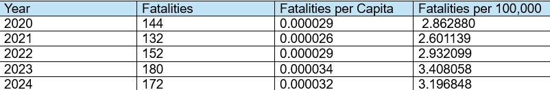

# Road Safety Analysis Project

A data-driven approach to understanding road fatalities in Ireland.

## Overview

The Road Safety Analysis Project examines road fatalities in Ireland over the past five years, identifying trends and patterns in fatality rates. The project integrates data from the Central Statistics Office (CSO) API and provides a custom API for CRUD operations on locally stored data. It also includes data visualization and analysis tools to offer insights into road safety trends. The project is designed to be user-friendly, secure, and extensible.

### Features:
- **Data Integration**: Retrieves road safety data from the CSO API.
- **Custom API**: Enables CRUD operations on locally stored fatality data using Flask.
- **Data Analysis**: Identifies trends in road fatalities and visualizes them using charts.
- **Frontend Interface**: A web-based dashboard for data exploration.
- **Secure Access**: Future implementation of OAuth authentication for secure data handling.

## Author

- **Name**: Edward Cronin
- **Student ID**: g00425645
- **Email**: g00425645@atu.ie

## Table of Contents

- [Overview](#overview)
- [Author](#author)
- [Features](#features)
- [Technical Set Up](#technical-set-up)
- [Project Structure](#project-structure)
- [Implementation Steps](#implementation-steps)
- [Pre-Requisites](#pre-requisites)
- [How to Download this Repository](#how-to-download-this-repository)
- [Code of Conduct](#code-of-conduct)
- [Dependencies](#dependencies)
- [Data Content Relevant To Task](#data-content-relevant-to-task)
- [Project Structure](#project-structure)
- [License](#license)
- [Part A: Access the API's and Fetch the Data](#part-a-access-the-api's-and-fetch-the-data)
- [Part B: Analysis](#part-b-analysis)
- [Part C: CRUD API](#part-c-crud-api)
- [Part D: Front End Development](#front-end-development)
- [Part E: OAuth (Open Authorization)](#Oauth-open-authorization)
- [Project References](#Project-References)
- [Conclusion](#conclusion)

## Technical Set Up

1. **Backend**:
   - Flask for RESTful API development.
   - Integration with the CSO API for data retrieval.
2. **Frontend**:
   - Interactive web interface using HTML, CSS, jQuery, and AJAX.
3. **Data Analysis**:
   - Data manipulation and visualization using `pandas`, `matplotlib`, and `seaborn`.
4. **Testing**:
   - API testing with Postman and CURL.
5. **Authentication**:
   - OAuth for secure access (future scope).

## Implementation Steps

1. **Data Retrieval**:
   - Fetch road safety data from the CSO API using HTTP GET requests.
   - Parse and convert the data into CSV format for analysis.
2. **Data Analysis**:
   - Analyze trends in road fatalities using Python libraries.
   - Visualize data with charts and graphs.
   - Analyse yearly fatality totals per capita and per 100,000 population.
3. **Custom API Development**:
   - Implement a Flask-based API to enable CRUD operations on the locally stored data.
4. **Frontend Development**:
   - Create a web interface for data visualization and management.
   - Use AJAX for seamless data retrieval and updates.
5. **Authentication**:
   - Explore OAuth for secure access to the API (future scope).

## Pre-Requisites

- **Languages**: Python, JavaScript, HTML, CSS.
- **Tools**: Postman, CURL, Git, Flask.
- **Libraries**: `pandas`, `numpy`, `matplotlib`, `seaborn`, jQuery, AJAX.

## How to Download this Repository

To download this repository, use the following command:

```bash
git clone https://github.com/ECronin1973/WSAA-Project
```

## Code of Conduct

Please read the CODE_OF_CONDUCT.md file for details on our code of conduct.

## Dependencies

The dependencies for this project are listed in the `requirements.txt` file.

## Data Content Relevant To Task

- [CSO Website - STATS API](https://ws.cso.ie/public/api.restful/PxStat.Data.Cube_API.ReadDataset/ROA29/JSON-stat/1.0/en)

## Project Structure

The project is organized as follows:

```plaintext
WSAA-Project/
│
├── data/
│   ├── fatalities_data.png                                 # Visualization of road fatalities data
│   ├── Fatalities_per_1000.png                             # Fatalities per 100,000 population graph
│   ├── fatalities_trend_graph.png                          # Visualization of trends
│   ├── fatality_analysis_chart.png                         # Dual-axis chart for fatalities analysis
│   ├── fatality_analysis.csv                               # Yearly fatalities analysis results
│   ├── fatality_trends.csv                                 # Trend analysis results
│   ├── five_yr_fatalities.csv                              # Filtered road fatalities data
│   ├── monthly_fatalities_over_the_last_5_years.png        # Monthly fatalities graph
│   ├── population_breakdown.csv                            # Population data from CSO API
│   ├── road_fatalities.csv                                 # Processed road fatalities data
│   ├── terminal_message_crud_api.png                       # Terminal output for CRUD API   
│   └── terminal_output_fatalities_per_capita.png          # Terminal output for fatalities per capita
│
├── src_files/
│   ├── 01_fatalities.py                                    # Script to fetch data from CSO API
│   ├── 02_trendanalysis.py                                 # Script for trend analysis
│   ├── 03_population.py                                    # Script to fetch population data from CSO API
│   ├── 04_data_analysis.py                                 # Script for data analysis and visualization
│   ├── 05_app.py                                           # Flask API for CRUD operations
│   └── 06_analyze_fatalities.py                           # Script for analyzing fatalities per capita
│
├── static/
│   ├── index.html                                          # Frontend HTML file
│   ├── app.js                                              # Frontend JavaScript file
│   └── styles.css                                          # Frontend CSS file
│
├── README.md                                               # Project documentation
├── requirements.txt                                        # Python dependencies
└── LICENSE                                                 # License file
```

## License

This project is licensed under the Apache License 2.0. See the LICENSE file for details.

# Part A:  Access the API's and Fetch the Data

## Step 1: Retrieve Road Safety Data via CURL

### Purpose:
Retrieve structured road fatalities data in JSON-stat format from the API endpoint for analysis and visualization.

### Command Used:
To make the GET request via Command Prompt, the following CURL command was executed:

```bash
curl -X GET "https://ws.cso.ie/public/api.restful/PxStat.Data.Cube_API.ReadDataset/ROA29/JSON-stat/1.0/en" -H "Content-Type: application/json"
```
This command fetched the data and displayed the results directly in the terminal.

### Reference:
[CURL Documentation](https://curl.se/)

## Step 2: Retrieve Data Using Postman

### Purpose:
Use Postman to interact with the API and retrieve road fatalities data in JSON-stat format for analysis and visualization.

### Command Used:
The following steps were executed in Postman:

- Opened Postman and created a new request.
- Selected the HTTP method as GET.
- Pasted the URL: https://ws.cso.ie/public/api.restful/PxStat.Data.Cube_API.ReadDataset/ROA29/JSON-stat/1.0/en.
- Set the Content-Type header to application/json.
- Sent the request and reviewed the JSON-stat response displayed in Postman.

### What the Command Did:
The GET request fetched structured data from the API endpoint. The response provided detailed road fatalities information, formatted as JSON-stat, which can be further processed for analysis.

### Why It Was Necessary:
This step was critical for verifying the API's functionality and ensuring the data was accessible in a structured format suitable for parsing and visualization.

### Reference:
[Postman Documentation](https://www.postman.com/)

## Step 3: Parse and Convert Data

### Purpose:
Process the retrieved JSON-stat data and convert it into a structured CSV format for monthly road fatalities analysis.

### Code Used in file '01_fatalities.py':
The following Python code from '01_fatalities.py' file was implemented to parse the JSON-stat response, structure the data, and save it as a CSV file:
```python
import requests
import csv
import os

# Define the API endpoint for fetching road fatalities data
url = "https://ws.cso.ie/public/api.restful/PxStat.Data.Cube_API.ReadDataset/ROA29/JSON-stat/1.0/en"

# Fetch data using a GET request
response = requests.get(url, headers={"Content-Type": "application/json"})

# Check if the API request was successful
if response.status_code == 200:
    data = response.json()  # Parse the JSON response
    print("Data retrieved successfully!")
else:
    print(f"Failed to fetch data. HTTP Status code: {response.status_code}")
    exit()  # Terminate the program if data fetch fails

# Extract fatalities data and corresponding months from the JSON-stat response
road_fatalities = data["dataset"]["value"]
month_labels = data["dataset"]["dimension"]["TLIST(M1)"]["category"]["label"]

# Combine the parsed data into a structured format (list of dictionaries)
formatted_data = [
    {"Month": month_labels[str(key)], "Fatalities": int(road_fatalities[idx])}
    for idx, key in enumerate(month_labels.keys())
]

# Define the directory and file path for saving the data
output_dir = os.path.join(os.path.dirname(__file__), "../data")
output_file = os.path.join(output_dir, "road_fatalities.csv")
os.makedirs(output_dir, exist_ok=True)  # Create the directory if it doesn't exist

# Save the structured data to a CSV file
with open(output_file, mode="w", newline="") as file:
    writer = csv.writer(file)
    writer.writerow(["Month", "Fatalities"])  # Write CSV header row
    for entry in formatted_data:
        writer.writerow([entry["Month"], entry["Fatalities"]])

print(f"Data successfully saved to {output_file}")

```
### What the Code Did:

- Parsed the JSON-stat data from the API to extract monthly road fatalities and their corresponding labels.
- Organized the data into a structured format with months and fatality counts.
- Saved the processed data into a CSV file (road_fatalities.csv) within a specified directory (../data).

### Why It Was Necessary:
Converting the data into a CSV format allows for easy analysis, visualization, and compatibility with tools such as spreadsheets or Python libraries like pandas

### Reference:
[Requests Library Documentation](https://requests.readthedocs.io/en/latest/).  
Provides details on how to make HTTP requests, handle responses, and parse JSON data in Python.

[Python CSV Module Documentation](https://docs.python.org/3/library/csv.html).
Explains how to read from and write to CSV files in Python, ensuring structured data storage.

[JSON-stat Format](https://json-stat.org/).
JSON-stat is a lightweight format designed for statistical data.

[OS Module in Python](https://docs.python.org/3/library/os.html).
Useful for handling file paths and creating directories dynamically in Python.

## Step 4: Monthly Trend Analysis

### Purpose:
Analyze the monthly road fatalities data by grouping it to identify patterns or trends. This step provides insights into variations over time and can serve as a basis for further statistical analysis or visualization.

### Code Used in file '02_trendanalysis.py':
The following Python code loads, filters, and analyzes the data saved in the CSV file and saves the filtered results as a new CSV file for the specified years:

```python
import pandas as pd
import os

# Define the relative path to the input CSV file containing road fatalities data
csv_file = os.path.join(os.path.dirname(__file__), "../data/road_fatalities.csv")

try:
    # Load data from the CSV file into a DataFrame
    data_frame = pd.read_csv(csv_file)
except FileNotFoundError:
    print(f"Error: The file {csv_file} does not exist.")
    exit()
except Exception as e:
    print(f"An unexpected error occurred while reading the file: {e}")
    exit()

# Split the "Month" column into separate "Year" and "Month" columns
# This assumes the "Month" column is in the format "Year Month" (e.g., "2024 January")
data_frame[["Year", "Month"]] = data_frame["Month"].str.extract(r"(\d{4})\s+(.*)")

# Filter the DataFrame to include rows for the last five years dynamically
current_year = 2024
filtered_data = data_frame[data_frame["Year"].astype(int).between(current_year - 4, current_year)]

# Define the output directory and file path for saving the filtered data
output_dir = os.path.join(os.path.dirname(__file__), "../data")
output_file = os.path.join(output_dir, "five_yr_fatalities.csv")
os.makedirs(output_dir, exist_ok=True)  # Create the directory if it doesn't exist

try:
    # Save the filtered data to a new CSV file
    filtered_data.to_csv(output_file, index=False)
    print(f"Filtered data successfully saved to {output_file}")
except Exception as e:
    print(f"An error occurred while writing the file: {e}")
    exit()
```
### What the Code did:
- **Load CSV File:** Reads the road_fatalities.csv file into a pandas DataFrame for analysis.
- **Extract Year and Month:**  Splits the "Month" column into two parts: "Year" and "Month". The year and month are extracted using the str.split() method.
- **Filter Relevant Data:** Filters the DataFrame to include only rows corresponding to the years 2024 to 2020 by checking if the "Year" column values are in the specified range.
- **Save Filtered Data:** Saves the filtered data into a new CSV file titled five_yr_fatalities.csv. This new file is stored in the same directory as the original file, making it easy to locate and use for further analysis or sharing.

### Why It Was Necessary:
Filtering the data to focus on the years 2024 to 2020 narrows the scope to the most recent and relevant period for analysis. Saving the filtered results into a new file ensures a clear, reusable dataset that can be used for further analysis or visualization. This cleaned format simplifies the exploration of trends and patterns.

### Reference:
[Pandas Documentation](https://pandas.pydata.org/docs/).
For reading, manipulating, and exporting data in DataFrames.

[Python OS Module](https://docs.python.org/3/library/os.html).
For constructing paths dynamically and ensuring compatibility across operating systems.

## Step 5 Retrieve population data from the CSO API 
Retrieve population data from the CSO API in JSON-stat format, parse the data, and export it to an Excel sheet for visualization and analysis

### Code Used in file '03_population.py':
The following Python code was implemented to parse the JSON-stat response, structure the data, and save it as a CSV file:

```python
import requests
import pandas as pd
import os

# Define the API endpoint URL for fetching population data
url = "https://ws.cso.ie/public/api.jsonrpc"

# Construct POST request payload
current_year = 2024  # Replace this with dynamic calculation if needed
year_range = [str(year) for year in range(current_year, current_year - 5, -1)]  # Last 5 years dynamically

payload = {
    "jsonrpc": "2.0",
    "method": "PxStat.Data.Cube_API.ReadDataset",
    "params": {
        "class": "query",
        "id": ["TLIST(A1)", "C02076V02508", "C02199V02655"],
        "dimension": {
            "TLIST(A1)": {"category": {"index": year_range}},
            "C02076V02508": {"category": {"index": ["-"]}},
            "C02199V02655": {"category": {"index": ["-"]}},
        },
        "extension": {
            "pivot": None,
            "codes": False,
            "language": {"code": "en"},
            "format": {"type": "JSON-stat", "version": "2.0"},
            "matrix": "PEA01"
        },
        "version": "2.0"
    }
}

try:
    # Send POST request to the API
    response = requests.post(url, json=payload)
    response.raise_for_status()  # Check for HTTP request errors
    data = response.json()  # Parse JSON-stat response
    print("Population data retrieved successfully!")
except requests.exceptions.RequestException as e:
    print(f"Error while fetching data: {e}")
    exit()
except KeyError:
    print("Unexpected data structure in JSON response.")
    exit()

# Extract population values and corresponding year labels
try:
    population_values = data["result"]["value"]  # Population values
    year_labels = data["result"]["dimension"]["TLIST(A1)"]["category"]["label"]  # Year labels
except KeyError:
    print("Failed to extract necessary data from the JSON response.")
    exit()

# Combine the extracted data into a DataFrame
population_data = pd.DataFrame({
    "Year": list(year_labels.values()),
    "Population (Thousand)": population_values
})

# Define the output directory and file path for saving the data
output_dir = os.path.join(os.path.dirname(__file__), "../data")
output_file = os.path.join(output_dir, "population_breakdown.csv")
os.makedirs(output_dir, exist_ok=True)  # Create directory if it doesn't exist

try:
    # Save the DataFrame to a CSV file
    population_data.to_csv(output_file, index=False)
    print(f"Population data successfully saved to {output_file}")
except Exception as e:
    print(f"An error occurred while writing the file: {e}")
    exit()
```

### What the Code did:
- **Retrieves Data:** Uses a POST request to interact with the CSO API and fetch population data for the years 2020–2024.
- **Structures Data:** Parses the JSON-stat response, organizes the population data alongside year labels, and stores them in a pandas DataFrame.
- **Exports Data:** Writes the DataFrame into an Excel file (population_breakdown.csv) within the ../data directory for convenient storage and usage.

### Why is it necessary:
Converting population data into a structured CSV format ensures compatibility with a wide range of analytical tools and platforms, such as Python, Excel, or data visualization software.

### Reference
- [Requests Library Documentation](https://requests.readthedocs.io/en/latest/)
- [Pandas Documentation](https://pandas.pydata.org/)
- [JSON-stat Format](https://json-stat.org/)

## PART B : Analysis 

### Part One : Road Fatalities Analysis

### Purpose:
The purpose of this analysis is to examine road fatalities over the last five years, identify trends, and visualize the data. The analysis includes detecting increases or decreases in fatalities, splitting the data into quarters for better insights, and saving the results for further use. The results are presented in a line graph with quarterly splits and saved as a CSV file for trend analysis.


### Code Used in file '04_data_analysis.py':

```python
import pandas as pd
import matplotlib.pyplot as plt
import seaborn as sns
import os

# Define the path to the input CSV file containing road fatality data
csv_file = os.path.join(os.path.dirname(__file__), "../data/five_yr_fatalities.csv")

try:
    # Load data from CSV file into a DataFrame
    fatality_data = pd.read_csv(csv_file)
    print("Data successfully loaded!")
except FileNotFoundError:
    print(f"Error: File {csv_file} not found.")
    exit()
except Exception as e:
    print(f"An unexpected error occurred: {e}")
    exit()

# Group and aggregate data by Year and Month to calculate total fatalities
grouped_fatality_data = fatality_data.groupby(["Year", "Month"], as_index=False).sum()

# Sort the data by Year and Month for proper visualization
month_order = [
    "January", "February", "March", "April", "May", "June",
    "July", "August", "September", "October", "November", "December"
]
grouped_fatality_data["Month"] = pd.Categorical(
    grouped_fatality_data["Month"], categories=month_order, ordered=True
)
grouped_fatality_data = grouped_fatality_data.sort_values(by=["Year", "Month"])

# Detect trends (increases or decreases) in fatalities
grouped_fatality_data["Change"] = grouped_fatality_data["Fatalities"].diff().fillna(0)
grouped_fatality_data["Trend"] = grouped_fatality_data["Change"].apply(
    lambda x: "Increase" if x > 0 else "Decrease" if x < 0 else "No Change"
)

# Save the trend data to a CSV file
trend_data_file = os.path.join(os.path.dirname(__file__), "../data/fatality_trends.csv")
try:
    grouped_fatality_data.to_csv(trend_data_file, index=False)
    print(f"Trend data successfully saved to {trend_data_file}")
except Exception as e:
    print(f"Error while saving trend data: {e}")
    exit()

# Create line plot for fatalities grouped by Year and Month
plt.figure(figsize=(12, 6))
sns.lineplot(data=grouped_fatality_data, x="Month", y="Fatalities", hue="Year", marker="o")

# Add vertical lines to split quarters
quarter_splits = ["March", "June", "September"]
for quarter in quarter_splits:
    plt.axvline(x=quarter, color="red", linestyle="--", alpha=0.7)

# Annotate quarters on the graph
quarters = {"Q1": 1.5, "Q2": 4.5, "Q3": 7.5, "Q4": 10.5}
for quarter, position in quarters.items():
    plt.text(position, grouped_fatality_data["Fatalities"].max() + 2, quarter, ha="center", fontsize=10, color="black")

# Annotate each data point with fatality count
for _, row in grouped_fatality_data.iterrows():
    plt.text(row["Month"], row["Fatalities"] + 0.5, str(row["Fatalities"]), ha="center", fontsize=8)

# Chart details and formatting
plt.title("Monthly Road Fatalities Over the Last 5 Years with Quarterly Splits")
plt.xlabel("Month")
plt.ylabel("Fatalities")
plt.legend(title="Year")
plt.xticks(rotation=45)
plt.tight_layout()

# Save the graph to the output directory
graph_file = os.path.join(os.path.dirname(__file__), "../data/fatalities_trend_graph.png")
try:
    plt.savefig(graph_file)
    print(f"Graph successfully saved to {graph_file}")
except Exception as e:
    print(f"Error while saving graph: {e}")
    exit()

plt.show()
```

### What the Code Did:

1. **Load Data**:
   - The code reads the `five_yr_fatalities.csv` file, which contains monthly road fatalities data for the last five years.

2. **Group and Sort Data**:
   - Groups the data by `Year` and `Month` to calculate total fatalities for each month.
   - Sorts the months in calendar order for proper visualization.

3. **Detect Trends**:
   - Calculates the change in fatalities between consecutive months.
   - Categorizes the trend as "Increase," "Decrease," or "No Change."

4. **Save Trend Data**:
   - Saves the grouped and processed data, including the trend information, to a CSV file named fatality_trends.csv.

5. **Visualize Data**:
   - Creates a line graph showing monthly fatalities for each year.
   - Adds vertical dashed lines to split the graph into quarters (Q1, Q2, Q3, Q4).
   - Annotates the quarters and adds labels above each data point to display the exact fatality totals.

6. **Save Graph**:
   - Saves the graph as an image file (`fatalities_trend_graph.png`) in the `data` folder.

### Output:

#### 1. **Trend Data (`fatality_trends.csv`)**:
The trend data includes the following columns:
- `Year`: The year of the data.
- `Month`: The month of the data.
- `Fatalities`: The total fatalities for the month.
- `Change`: The difference in fatalities compared to the previous month.
- `Trend`: Indicates whether the fatalities increased, decreased, or remained the same.

Example:
```csv
Year,Month,Fatalities,Change,Trend
2020,January,9,0.0,No Change
2020,February,19,10.0,Increase
2020,March,17,-2.0,Decrease
...
```

#### 2. **Graph (`fatalities_trend_graph.png`)**:
- A line graph showing monthly fatalities for each year.
- Vertical dashed lines split the graph into quarters (Q1, Q2, Q3, Q4).
- Labels above each data point display the exact fatality totals.

### Why It Was Necessary:
- **Trend Analysis**: Helps identify patterns in road fatalities over time, such as seasonal trends or sudden spikes.
- **Quarterly Insights**: Splitting the data into quarters provides a clearer understanding of how fatalities vary throughout the year.
- **Data Storage**: Saving the trend data and graph ensures the results are reusable for further analysis or reporting.

### References:
- [Pandas Documentation](https://pandas.pydata.org/docs/)
- [Matplotlib Documentation](https://matplotlib.org/stable/contents.html)
- [Seaborn Documentation](https://seaborn.pydata.org/)
- [Python OS Module](https://docs.python.org/3/library/os.html)

### Summary of Analysis

- **Steady Decrease in Early 2021:** The first quarter (January-March) of 2021 showed a significant drop in fatalities, starting at 3 in January, then climbing slightly by March. This reflects a potential stabilization.
- **Highest Single-Year Increase:** December 2021 saw the highest single-month increase in fatalities (+16).
- **Consistent Seasonal Declines:** Across all years, October-December consistently experienced decreases in fatalities.
- **Notable Decline in Early 2023:** January to March 2023 showed a consistent decrease in fatalities, ending March at only 11 fatalities.
- **Rise in August Each Year:** August generally experienced increases in fatalities across most years, notably in 2021 (+4), 2023 (+9), and 2020 (+6).
- **Volatility in June:** June saw fluctuating trends year-on-year, ranging from increases in 2021 (+2) to sharp decreases in 2023 (-10).
- **Overall Decrease in 2022:** Year 2022 exhibited more months of decreasing fatalities compared to prior years, indicating a calmer trend overall.
- **Spike in May 2023:** A sharp increase was recorded in May 2023, with fatalities reaching 20 (+10).
- **Decreasing Trends in Q4:** Quarter 4 (October-December) consistently exhibited declining trends in fatalities, highlighting seasonal patterns.
- **Recurring Stability in September:** Several Septembers showed minimal change or minor decreases, suggesting consistency.

### Quarterly Summary:

**January to March:**
- 2020: Fatalities fluctuated from 9 to 17.
- 2021: Dropped to as low as 3, then slowly rebounded to 9.
- 2022: Stable increase from 13 to 16.
- 2023: Decline from 16 to 11.
- 2024: Minor fluctuations, ending at 18 fatalities in March.

**April to June:**
- 2020: Fatalities reduced sharply, hitting a low of 6 in May, then rose in June.
- 2021: Spiked sharply to 18 in April, then fluctuated.
- 2022: Gradual increase, peaking at 13 in June.
- 2023: Fatalities sharply declined in June (-10).
- 2024: Fluctuated minimally, reaching 11 in June.

**July to September:**
- 2020: Steady increases by September to 17.
- 2021: Volatility peaked at 21 in August, before dipping sharply in September.
- 2022: Relatively stable trend, reducing to 9 in September.
- 2023: Extreme fluctuation, from 26 in August to 9 in September.
- 2024: Stable trends with minor changes, staying within 12-21 fatalities.

**October to December:**
- 2020: Declined consistently, ending at 8 fatalities.
- 2021: Volatile, peaking at 19 in December.
- 2022: Saw mixed trends, ending with a decline.
- 2023: Significant spike to 22 in October, followed by a stabilization.
- 2024: Fluctuating trend, peaking at 17 in November

### Part Two : Analyse yearly fatality totals per capita and per 100,000 population

### Tasks performed by the code:

The code performs the following tasks:

**Load Data:** Reads road fatalities and population data from CSV files into pandas DataFrames.

**Calculate Yearly Fatalities:** Groups the fatalities data by year and calculates the total fatalities for each year.

**Merge Data:** Combines the yearly fatalities data with the population data based on the year.
Merge Data: Combines the yearly fatalities data with the population data based on the year.

**Calculate Metrics:** Computes two key metrics:
  - Fatalities per Capita: Calculates fatalities as a proportion of the total population.
  - Fatalities per 100,000 Population: Normalizes fatalities to a standard scale for easier comparison across years.

**Output Results:** Displays the merged data, including the calculated metrics, in the console and saves it to a new CSV file (fatality_analysis.csv).

**Visualize Data:** Creates visualizations:
  - A line chart titled 'Fatalities_per_1000.png' displaying fatalities per 100,000 population over the years.
  
  - A dual-axis chart titled 'fatality_analysis_chart.png' combining the bar chart (total fatalities) and line chart (fatalities per 100,000) for a comprehensive view.
  
  - The dual-axis chart allows for simultaneous visualization of total fatalities and fatalities per 100,000 population, providing a clearer understanding of trends.
 
- **Save Chart:** Exports the dual-axis chart as an image file (fatality_analysis_chart.png) to the data folder.

### Code Used in file '06_analyze_fatalities.py' to conduct analysis:

```python
import pandas as pd
import matplotlib.pyplot as plt
import os

# Define file paths for input data
fatalities_file = r"c:\Users\eCron\OneDrive\Documents\ATU_CourseWork\Web Services and Applications\Assessments\Project\WSAA-Project\data\five_yr_fatalities.csv"
population_file = r"c:\Users\eCron\OneDrive\Documents\ATU_CourseWork\Web Services and Applications\Assessments\Project\WSAA-Project\data\population_breakdown.csv"

try:
    # Load fatality data and population data from CSV files
    fatalities_df = pd.read_csv(fatalities_file)
    population_df = pd.read_csv(population_file)
    print("Data successfully loaded!")
except FileNotFoundError as e:
    print(f"Error: File not found. {e}")
    exit()
except pd.errors.EmptyDataError as e:
    print(f"Error: File is empty or invalid. {e}")
    exit()
except Exception as e:
    print(f"An unexpected error occurred: {e}")
    exit()

# Calculate yearly fatality totals
yearly_fatalities = fatalities_df.groupby("Year")["Fatalities"].sum().reset_index()

try:
    # Merge yearly fatalities with population data
    merged_df = pd.merge(yearly_fatalities, population_df, on="Year")
except KeyError as e:
    print(f"Error: Failed to merge dataframes. {e}")
    exit()

# Calculate fatalities per capita and per 100,000 population
merged_df["Fatalities per Capita"] = merged_df["Fatalities"] / (merged_df["Population (Thousand)"] * 1000)
merged_df["Fatalities per 100,000"] = (merged_df["Fatalities"] / (merged_df["Population (Thousand)"] * 1000)) * 100000

# Save results to a new CSV file
output_csv_path = r"c:\Users\eCron\OneDrive\Documents\ATU_CourseWork\Web Services and Applications\Assessments\Project\WSAA-Project\data\fatality_analysis.csv"
try:
    merged_df.to_csv(output_csv_path, index=False)
    print(f"Analysis results saved to {output_csv_path}")
except Exception as e:
    print(f"Error while saving analysis results: {e}")
    exit()

# Function for bar chart visualization
def plot_bar_chart(data, x, y, title, xlabel, ylabel, save_path, color="skyblue"):
    plt.figure(figsize=(10, 6))
    plt.bar(data[x], data[y], color=color)
    plt.xlabel(xlabel)
    plt.ylabel(ylabel)
    plt.title(title)
    plt.tight_layout()
    try:
        plt.savefig(save_path)
        print(f"Chart saved to {save_path}")
    except Exception as e:
        print(f"Error while saving chart: {e}")
    plt.show()

# Plot total fatalities bar chart
plot_bar_chart(
    merged_df,
    x="Year",
    y="Fatalities",
    title="Yearly Fatalities",
    xlabel="Year",
    ylabel="Total Fatalities",
    save_path=r"c:\Users\eCron\OneDrive\Documents\ATU_CourseWork\Web Services and Applications\Assessments\Project\WSAA-Project\data\yearly_fatalities_chart.png"
)

# Plot fatalities per 100,000 line chart
plt.figure(figsize=(10, 6))
plt.plot(merged_df["Year"], merged_df["Fatalities per 100,000"], marker="o", color="orange")
plt.xlabel("Year")
plt.ylabel("Fatalities per 100,000")
plt.title("Fatalities per 100,000 Population")
plt.tight_layout()
try:
    plt.savefig(r"c:\Users\eCron\OneDrive\Documents\ATU_CourseWork\Web Services and Applications\Assessments\Project\WSAA-Project\data\fatalities_per_100k_chart.png")
    print("Fatalities per 100,000 chart saved successfully.")
except Exception as e:
    print(f"Error while saving fatalities per 100,000 chart: {e}")
plt.show()

```

### Insights on Fatalities and Population Data



1. **Yearly Fatalities**: The total number of fatalities as displayed in the 'terminal_output_fatalities_per_capita.png' image varies each year, with the highest being 180 in 2023 and the lowest being 132 in 2021.

2. **Population Growth**: The population increases steadily each year, starting at 5,029.9 thousand in 2020 and reaching 5,380.3 thousand in 2024.

3. **Fatalities per Capita**: This metric, which represents fatalities relative to the total population, is very small (in the range of 0.00003) and increases slightly over the years.

4. **Fatalities per 100,000 Population**: This metric provides a normalized view of fatalities, making it easier to compare across years. It ranges from 2.60 in 2021 to 3.41 in 2023.

5. **Trend in Fatalities**: Fatalities generally increase from 2021 to 2023, peaking in 2023, before slightly decreasing in 2024.

6. **Population Impact**: Despite the growing population, the fatalities per capita and per 100,000 population show that the rate of fatalities is not directly proportional to population growth.

7. **Lowest Fatality Rate**: The year 2021 has the lowest fatalities per 100,000 population (2.60), indicating a relatively safer year compared to others.

8. **Highest Fatality Rate**: The year 2023 has the highest fatalities per 100,000 population (3.41), suggesting a significant increase in fatalities relative to the population.

9. **Fatalities vs. Population**: While the population grows steadily, the number of fatalities does not follow a consistent trend, indicating other factors influencing fatalities.

10. **Data Normalization**: The inclusion of "Fatalities per Capita" and "Fatalities per 100,000" provides a normalized perspective, making it easier to compare the impact of fatalities across years with varying population sizes.

## PART C : CRUD API

A functional CRUD API for managing road fatalities data using Flask and Flask-RESTful is designed to efficiently handle Create, Read, Update, and Delete operations on road fatalities records. This API ensures seamless data management and enables users to interact with road fatalities data through a user-friendly and scalable interface. It supports data validation, modular design, and integration with external tools like Postman for testing and documentation, making it suitable for analysis, visualization, and tracking trends over time.

Below are the steps and functionalities implemented in the code:

### 1. Setup and Initialization
**Flask and Flask-RESTful:**
- The Flask framework is used to create the web application.
- Flask-RESTful simplifies the creation of RESTful APIs by providing a Resource class for defining endpoints.
**App Initialization:**
- app = Flask(__name__) initializes the Flask application.
- api = Api(app) initializes the RESTful API.

### 2. In-Memory Data Store
**Purpose:**
- The data_store list is used as a temporary in-memory database to store road fatalities data.
**Each record contains:**
- id: A unique identifier for the record.
- year: The year of the record.
- month: The month of the record.
- fatalities: The number of fatalities for that month.
**Auto-Increment ID:**
The next_id variable ensures that each new record gets a unique id.

### 3. CRUD Operations
The FatalitiesResource class defines the CRUD operations for managing the data.

#### a. READ (GET)
**Functionality:**
- Fetches all records or a specific record by id.
- If an id is provided as a query parameter, it searches for the record with that id.
- If no id is provided, it returns all records.
**Error Handling:**
- Returns a 404 status code with a "Record not found" message if the record does not exist.

#### b. CREATE (POST)
**Functionality:**
- Accepts a JSON payload to create a new record.
- Adds the record to the data_store with a unique id.
**Validation:**
- Ensures that the required fields (year, month, fatalities) are present in the request.
- Validates that fatalities is a non-negative integer.
**Response:**
- Returns a 201 status code with a success message and the created record.

#### c. UPDATE (PUT)
**Functionality:**
- Updates an existing record by id with the provided JSON payload.
- earches for the record with the specified id and updates its fields.
**Error Handling:**
- Returns a 404 status code with a "Record not found" message if the record does not exist.
**Response:**
- Returns a 200 status code with a success message and the updated record.

#### d. DELETE (DELETE)
**Functionality:**
- Deletes a record by id.
- Removes the record from the data_store.
**Error Handling:**
- Returns a 404 status code with a "Record not found" message if the record does not exist.
**Response:**
- Returns a 200 status code with a success message.

### 4. API Routes

**Endpoints:**
- /api/fatalities: Handles GET and POST requests.
- /api/fatalities/<int:record_id>: Handles PUT and DELETE requests for a specific record by id.

**Route Registration:**
api.add_resource(FatalitiesResource, '/api/fatalities', '/api/fatalities/<int:record_id>') registers the resource with the specified routes.

### 5. Running the Application
**Debug Mode:**
- The application runs in debug mode (app.run(debug=True)), which provides detailed error messages and auto-reloads the server during development.
**Access:**
- The API is accessible at http://127.0.0.1:5000/api/fatalities.

### Code used in file '06_api.py' to implement the CRUD API

```python
from flask import Flask, request, jsonify
from flask_restful import Resource, Api
from flask_cors import CORS
import pandas as pd

app = Flask(__name__)
CORS(app)
api = Api(app)

# Path to the CSV file
csv_file_path = "../data/five_yr_fatalities.csv"

# Helper class to manage data storage
class DataStore:
    def __init__(self, csv_file):
        self.csv_file = csv_file
        try:
            self.df = pd.read_csv(self.csv_file)
            if "id" not in self.df.columns:
                self.df.insert(0, "id", range(1, len(self.df) + 1))
                self.save()
        except FileNotFoundError:
            print(f"Error: {self.csv_file} not found. Initializing an empty data store.")
            self.df = pd.DataFrame(columns=["id", "Year", "Month", "Fatalities"])

    def save(self):
        self.df.to_csv(self.csv_file, index=False)

    def get_all(self):
        return self.df.to_dict(orient="records")

    def get_by_id(self, record_id):
        return self.df.loc[self.df["id"] == record_id].to_dict(orient="records")

    def add_record(self, record):
        new_id = self.df["id"].max() + 1 if not self.df.empty else 1
        record["id"] = new_id
        self.df = self.df.append(record, ignore_index=True)
        self.save()
        return record

    def update_record(self, record_id, updates):
        index = self.df.index[self.df["id"] == record_id].tolist()
        if not index:
            return None
        self.df.loc[index[0], updates.keys()] = updates.values()
        self.save()
        return self.df.loc[index[0]].to_dict()

    def delete_record(self, record_id):
        index = self.df.index[self.df["id"] == record_id].tolist()
        if not index:
            return None
        self.df = self.df.drop(index[0])
        self.save()
        return True

# Initialize the data store
data_store = DataStore(csv_file_path)

class FatalitiesResource(Resource):
    def get(self):
        record_id = request.args.get("id")
        if record_id:
            record = data_store.get_by_id(int(record_id))
            if record:
                return record[0], 200
            return {"message": "Record not found"}, 404
        return data_store.get_all(), 200

    def post(self):
        new_record = request.json
        required_fields = {"Year", "Month", "Fatalities"}
        if not required_fields.issubset(new_record):
            return {"message": "Missing required fields"}, 400
        if not isinstance(new_record["Fatalities"], int) or new_record["Fatalities"] < 0:
            return {"message": "Invalid fatalities value"}, 400
        created_record = data_store.add_record(new_record)
        return {"message": "Record created successfully", "record": created_record}, 201

    def put(self, record_id):
        updates = request.json
        updated_record = data_store.update_record(record_id, updates)
        if not updated_record:
            return {"message": "Record not found"}, 404
        return {"message": "Record updated successfully", "record": updated_record}, 200

    def delete(self, record_id):
        if data_store.delete_record(record_id):
            return {"message": "Record deleted successfully"}, 200
        return {"message": "Record not found"}, 404

class GroupedFatalitiesResource(Resource):
    def get(self):
        df = data_store.df
        grouped_df = df.groupby(["Year", "Month"], as_index=False).sum()
        month_order = [
            "January", "February", "March", "April", "May", "June",
            "July", "August", "September", "October", "November", "December"
        ]
        grouped_df["Month"] = pd.Categorical(grouped_df["Month"], categories=month_order, ordered=True)
        grouped_df = grouped_df.sort_values(by=["Year", "Month"])
        return grouped_df.to_dict(orient="records"), 200

api.add_resource(FatalitiesResource, "/api/fatalities", "/api/fatalities/<int:record_id>")
api.add_resource(GroupedFatalitiesResource, "/api/grouped-fatalities")

if __name__ == "__main__":
    app.run(debug=True)

```

### Terminal Output

When the application was running, the terminal displayed the following messages.  
```
* Restarting with watchdog (windowsapi)
* Debugger is active!
* Debugger PIN: 397-799-927 
```

The following image captures output when API Usage is performed.


#### API Usage

##### 1. Create a New Record
**Request:**
```
POST http://127.0.0.1:5000/api/fatalities
Content-Type: application/json

{
    "year": 2021,
    "month": "April",
    "fatalities": 18
}
```
**Response:**
```
{
    "message": "Record created successfully",
    "record": {
        "year": 2021,
        "month": "April",
        "fatalities": 18,
        "id": 4
    }
}
```

##### 2. Read All records
**Request:**
```
GET /api/fatalities
```
**Response**
```
[
    { "id": 1, "year": 2020, "month": "January", "fatalities": 9 },
    { "id": 2, "year": 2020, "month": "February", "fatalities": 19},
    { "id": 3, "year": 2020, "month": "March", "fatalities": 17 },
    { "year": 2021, "month": "April", "fatalities": 18, "id": 4 }
]
```

##### 3. Update a Record
**Request:**
```
PUT /api/fatalities/2
Content-Type: application/json

{
    "fatalities": 20
}
```
**Response**
```
{
    "message": "Record updated successfully",
    "record": {
        "id": 2,
        "year": 2020,
        "month": "February",
        "fatalities": 20
    }
}
```

##### 3. Delete a Record
**Request:**
```
DELETE /api/fatalities/3
```
**Response**
```
{
    "message": "Record deleted successfully"
}
```

### References
**Flask Documentation**
[Flask Official Documentation](https://flask.palletsprojects.com/en/stable/)
Provides detailed information on how to build web applications using Flask.

**Flask-RESTful Documentation**
[Flask-RESTful Documentation](https://flask-restful.readthedocs.io/en/latest/)
Explains how to create RESTful APIs using Flask-RESTful, including the Resource class and route management.

**Postman Documentation**
[Postman Documentation](https://www.postman.com/)
Useful for testing CRUD API endpoints.

**Python Requests Library**
[Requests Library Documentation](https://requests.readthedocs.io/en/latest/)
Covers how to make HTTP requests and handle responses, which is useful for testing APIs programmatically.

## Part D : Frontend Development

The frontend of the project was designed to provide a user-friendly web interface for visualizing road safety data. It allows users to view monthly road fatalities over the last five years in both tabular and graphical formats. The interface dynamically fetches data from the backend API and updates the table and chart without requiring a page reload.

### Purpose
**Create a User-Friendly Web Interface:**
- Provide an intuitive and visually appealing interface for users to interact with the data.
- Display road fatalities data in a clear and organized table.
- Visualize trends in road fatalities using a line chart.
**Use jQuery and AJAX for Asynchronous Data Retrieval:**
- Fetch data dynamically from the backend API (/api/grouped-fatalities) without reloading the page.
- Ensure seamless integration between the frontend and backend.

### Implementation
**HTML Structure:**
The index.html file provides the structure for the web interface, including:
-  A table (#fatalitiesTable) to display monthly fatalities data.
-  A chart (#fatalitiesChart) to visualize trends in fatalities.

**Code used in file 'index.html' to implement the frontend:**
```html
<!DOCTYPE html>
<html lang="en">
<head>
    <meta charset="UTF-8">
    <meta name="viewport" content="width=device-width, initial-scale=1.0">
    <title>Road Safety Analysis</title>
    <link rel="stylesheet" href="css/styles.css">
    <script src="https://code.jquery.com/jquery-3.6.0.min.js"></script>
    <script src="https://cdn.jsdelivr.net/npm/chart.js"></script>
    <script src="js/app.js"></script>
</head>
<body>
    <header class="header">
        <h1>Road Safety Analysis</h1>
    </header>
    <main>
        <section id="chart-section" class="chart-section">
            <h2>Monthly Fatalities Over the Last 5 Years</h2>
            <canvas id="fatalitiesChart" aria-label="Line chart showing monthly fatalities"></canvas>
        </section>
        <section id="data-section" class="data-section">
            <h2>Fatalities Data</h2>
            <table id="fatalitiesTable" aria-label="Fatalities Data Table">
                <thead>
                    <tr>
                        <th>ID</th>
                        <th>Year</th>
                        <th>Month</th>
                        <th>Fatalities</th>
                    </tr>
                </thead>
                <tbody>
                    <!-- Data will be dynamically fetched from the API and inserted here -->
                </tbody>
            </table>
            <div id="error-message" class="error-message" hidden></div>
        </section>
    </main>
</body>
</html>
```

#### Dynamic Data Handling:
- The app.js file uses jQuery and AJAX to fetch data from the backend API and dynamically populate the table and chart.

**Code used in file 'app.js' to implement the frontend:**

```javascript
$(document).ready(function () {
    const apiUrl = "http://127.0.0.1:5000/api/grouped-fatalities"; // API endpoint for grouped data
    let fatalitiesChart; // Declare chart instance globally to manage updates

    // Fetch data from the API
    function fetchData() {
        $.ajax({
            url: apiUrl,
            method: "GET",
            success: function (data) {
                console.log("Data fetched successfully:", data); // Debugging
                populateTable(data);
                renderChart(data);
            },
            error: function () {
                console.error("Error fetching data");
                displayError("Failed to load data from the server.");
            }
        });
    }

    // Populate the table with data
    function populateTable(data) {
        const tableBody = $("#fatalitiesTable tbody");
        tableBody.empty(); // Clear existing rows
        data.forEach((record, index) => {
            const row = `
                <tr>
                    <td>${index + 1}</td>
                    <td>${record.Year}</td>
                    <td>${record.Month}</td>
                    <td>${record.Fatalities}</td>
                </tr>
            `;
            tableBody.append(row);
        });
    }

    // Display error messages to the user
    function displayError(message) {
        const errorDiv = $("#errorMessage");
        errorDiv.text(message).show(); // Show error message
    }

    // Render the chart using Chart.js
    function renderChart(data) {
        const ctx = document.getElementById("fatalitiesChart").getContext("2d");

        // Prepare data for the chart
        const labels = data.map(record => `${record.Month} ${record.Year}`);
        const fatalities = data.map(record => record.Fatalities);

        // Clear the existing chart if it exists
        if (fatalitiesChart) {
            fatalitiesChart.destroy();
        }

        // Create a new chart instance
        fatalitiesChart = new Chart(ctx, {
            type: "line",
            data: {
                labels: labels,
                datasets: [{
                    label: "Monthly Fatalities",
                    data: fatalities,
                    borderColor: "rgba(75, 192, 192, 1)",
                    backgroundColor: "rgba(75, 192, 192, 0.2)",
                    borderWidth: 2,
                    fill: true
                }]
            },
            options: {
                responsive: true,
                plugins: {
                    legend: {
                        display: true,
                        position: "top"
                    }
                },
                scales: {
                    x: {
                        title: {
                            display: true,
                            text: "Month"
                        }
                    },
                    y: {
                        title: {
                            display: true,
                            text: "Fatalities"
                        },
                        beginAtZero: true
                    }
                }
            }
        });
    }

    // Fetch data on page load
    fetchData();
});
```

**Chart Visualization:**
- The Chart.js library is used to render a line chart that shows monthly fatalities over the last five years.
**Styling:**
- The styles.css file ensures the interface is visually appealing and easy to navigate

### Steps to Run the Frontend
1. Ensure the backend API (05_app.py) is running (Flask app).
- Open a terminal, navigate to the directory containing the backend file, and execute:
```python
python 05_app.py
```
- Confirm the API is accessible at
```
http://127.0.0.1:5000/api/grouped-fatalities
```

2. Verify Frontend Files
- Ensure the following files are in the static folder:
  - index.html in the static directory.
  - styles.css in the static/css directory.
  - app.js in the static/js directory.

3. Open the Frontend in a Browser
 - Open the index.html file in a web browser (e.g., Chrome, Firefox).
 - Use a local web server if necessary (e.g., Python's HTTP server):
 ```python
python -m http.server
```
Navigate to http://127.0.0.1:8000/static/index.html in the browser.

4. Verify Data Fetching 
 - Check the browser console (Developer Tools > Console) for any errors.
 - Ensure the table and chart are populated with data fetched from the backend API.

5. Inspect the Table
- Verify that the table (#fatalitiesTable) displays the correct data:
 - Columns: ID, Year, Month, Fatalities.
 - Rows dynamically populated with API data.

 6. Inspect the Chart
 - Confirm that the chart renders correctly:
 - A line chart showing monthly fatalities over the last five years.
 - Labels and data points match the API data.

7. Interact with the Interface
- Users can interact with the chart and table to view trends in road fatalities.
- Data is fetched asynchronously, allowing for real-time updates without page reloads.

### Outcome
**1. User-Friendly Web Interface:**
- The interface successfully displays road fatalities data in a table and a line chart.
- Users can easily view trends and patterns in the data.
**2. Seamless Asynchronous Data Retrieval:**
- Data is fetched dynamically from the backend API using jQuery and AJAX.
- The table and chart update automatically without requiring a page reload.
**3.Visualization of Trends:**
- The line chart provides a clear visualization of monthly fatalities trends over the last five years.
- The table complements the chart by providing detailed numerical data.

### Screenshots
Image 'monthly_fatalities_over_the_last_5_years.png' displays an interactive chart with data displayed by hovering over each monthly point accessible at http://127.0.0.1:5500/WSAA-Project/static/index.html


Image 'Fatalities_Data.png' displays a chart with headings 'ID, Year, Month, Fatalities' which is accessed at http://127.0.0.1:5500/WSAA-Project/static/index.html


This interface is intuitive, visually appealing, and effectively displays the data in both tabular and graphical formats.  Data is dynamically fetched from the backend API and displayed in real-time without requiring a page reload.  This method of accessing data is preferred as it negates the necessity to re run programs when CRUD actions are undertaken.

## Part E: OAuth (Open Authorization)

OAuth (Open Authorization) is an open standard protocol that allows secure, delegated access to resources on behalf of a user. It is commonly used to grant third-party applications limited access to a user's resources (e.g., data or services) without exposing the user's credentials (like passwords).

OAuth was not considered necessary in this project for the following reasons

**Private Repository:**
- A private GitHub repository is already secure and accessible only to authorized users with the appropriate permissions.
- GitHub handles authentication and access control for private repositories, so additional layers like OAuth are redundant in this context.

**No Public API Exposure:**
- If the API is not being hosted on a public server and is only being used locally (e.g., http://127.0.0.1:5000), there is no need for OAuth since the API is not exposed to external users.

**Limited Scope:**
- The project is focused on analyzing and visualizing road safety data, with CRUD operations on a local dataset. There is no sensitive or user-specific data that requires advanced authentication mechanisms like OAuth.

**Development and Testing Context:**
The project is primarily for coursework, development, or testing purposes, implementing OAuth would add unnecessary complexity without providing significant benefits.

## References

- [OAuth 2.0 Authorization Framework (RFC 6749)](https://datatracker.ietf.org/doc/html/rfc6749)  
  The official specification for OAuth 2.0, detailing the protocol and its components.
- [OAuth 2.0 Simplified](https://aaronparecki.com/oauth-2-simplified/)  
  A beginner-friendly guide to understanding OAuth 2.0.
- [OAuth.net](https://oauth.net/)  
  A comprehensive resource for learning about OAuth, including tutorials and libraries.
- [Google Identity Platform OAuth 2.0 Documentation](https://developers.google.com/identity/protocols/oauth2)  
  Google's implementation of OAuth 2.0 for accessing Google APIs.
- [Microsoft Identity Platform OAuth 2.0 Documentation](https://learn.microsoft.com/en-us/azure/active-directory/develop/v2-oauth2-auth-code-flow)  
  Microsoft's guide to implementing OAuth 2.0 for Azure and Microsoft services.

## Conclusion

The Road Safety Analysis Project successfully achieved its objectives of analyzing and visualizing road fatalities in Ireland over the past five years. By integrating data from the Central Statistics Office (CSO) API and implementing a custom Flask-based API, the project provided a robust platform for CRUD operations and data management. The frontend interface, developed using HTML, CSS, jQuery, and Chart.js, offered an intuitive and interactive way for users to explore trends and patterns in road safety data.

#### Key Achievements:
1. **Data Integration and Processing**:
   - Successfully fetched and processed road fatalities data from the CSO API.
   - Converted raw data into structured formats (CSV) for analysis and visualization.

2. **Comprehensive Data Analysis**:
   - Identified monthly trends and seasonal patterns in road fatalities.
   - Conducted yearly analysis of fatalities per capita and per 100,000 population, providing normalized insights.

3. **Custom API Development**:
   - Implemented a functional CRUD API using Flask and Flask-RESTful.
   - Enabled seamless data management with robust validation and error handling.

4. **Interactive Frontend Interface**:
   - Developed a user-friendly web interface for visualizing road safety data.
   - Dynamically displayed data in tabular and graphical formats using AJAX for real-time updates.

5. **Visualization of Trends**:
   - Created detailed charts and graphs to highlight trends in road fatalities.
   - Provided dual-axis visualizations for a comprehensive understanding of fatalities relative to population growth.

6. **Secure and Extensible Design**:
   - Designed the project to be secure and extensible, with future scope for incorporating OAuth for authentication.

#### Key Findings:
- **Seasonal Trends**: Fatalities consistently decreased in the last quarter of each year, while spikes were observed in summer months like August.
- **Yearly Insights**: The year 2023 recorded the highest fatalities, while 2021 had the lowest fatalities per 100,000 population.
- **Population Impact**: Despite population growth, fatalities per capita remained relatively stable, indicating other influencing factors.
- **Data Normalization**: Normalized metrics like fatalities per 100,000 population provided clearer insights into road safety trends.

#### Future Scope:
- **Authentication**: Implement OAuth for secure access to the API when deployed in a public environment.
- **Enhanced Visualizations**: Add more interactive features to the frontend, such as filtering and exporting data.
- **Predictive Analysis**: Incorporate machine learning models to predict future trends in road fatalities.

This project demonstrates the effective use of modern web technologies and data analysis tools to address a real-world problem. It provides a strong foundation for further development and serves as a valuable resource for understanding road safety trends in Ireland.

## Acknowledgements
Github Copilot. "This work was partially supported by GitHub Copilot, an AI-powered code completion tool developed by GitHub, which assisted in generating parts of the code."

## Project References

- [Chart.js Documentation](https://www.chartjs.org/docs/latest/)
- [CURL Documentation](https://curl.se/)
- [Flask Official Documentation](https://flask.palletsprojects.com/en/stable/)
- [Flask-RESTful Documentation](https://flask-restful.readthedocs.io/en/latest/)
- [GitHub Copilot](https://github.com/features/copilot)
- [Google Identity Platform OAuth 2.0 Documentation](https://developers.google.com/identity/protocols/oauth2)
- [JSON-stat Format](https://json-stat.org/)
- [Markdown Guide](https://www.markdownguide.org/)
- [Matplotlib Documentation](https://matplotlib.org/stable/contents.html)
- [Microsoft Identity Platform OAuth 2.0 Documentation](https://learn.microsoft.com/en-us/azure/active-directory/develop/v2-oauth2-auth-code-flow)
- [OAuth 2.0 Authorization Framework (RFC 6749)](https://datatracker.ietf.org/doc/html/rfc6749)
- [OAuth 2.0 Simplified](https://aaronparecki.com/oauth-2-simplified/)
- [OAuth.net](https://oauth.net/)
- [OS Module in Python](https://docs.python.org/3/library/os.html)
- [Pandas Documentation](https://pandas.pydata.org/docs/)
- [Postman Documentation](https://www.postman.com/)
- [Python CSV Module Documentation](https://docs.python.org/3/library/csv.html)
- [Requests Library Documentation](https://requests.readthedocs.io/en/latest/)
- [Seaborn Documentation](https://seaborn.pydata.org/)

# END